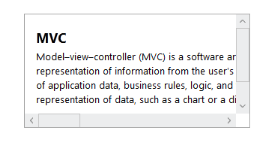

# Getting Started

This section explains briefly about how to create a Scroller in your ASP.NET MVC application.

## Create your first Scroller in MVC

ASP.NET MVCScroller control allows you to slide document whose position corresponds to a value. The document has text, HTML content or images. Refer the following guidelines to create a Scroller control for horizontal and vertical Scrolling.

Add Scroller Control to your MVC Application

Essential Studio ASP.NET MVC Scoller control has a built-in feature to customize the resizing and changing the Scrollbar theme.

1. Create an MVC Project and add required assemblies, scripts, and styles to it. Refer [MVC-Getting Started](http://help.syncfusion.com/ug/js/Documents/gettingstartedwithmv.htm) Documentation.
2. Add the following code example to the corresponding view page to render the Scroller. 

&lt;div id="scrollcontent"&gt;

        &lt;div&gt; @* Wrapper div for Scroller.*@

            &lt;div class="innercontent"&gt; @* Content div*@

                &lt;h3&gt; MVC &lt;/h3&gt;

                &lt;p&gt;

                 Model–view–controller (MVC) is a software architecture pattern which   

                 separates the representation of information from the user's interaction 

                 with it. The model consists of application data, business rules, logic, and 

                 functions. A view can be any output representation of data, such as a chart 

                 or a diagram. 

                &lt;/p&gt;

&lt;/div&gt;

&lt;/div&gt;

&lt;/div&gt;   

    @{ Html.EJ().Scroller("scrollcontent").Height(150).Width(300).Render(); }

3. Add the following style in the view page to set the height and width of the Scroller.

&lt;style type="text/css" class="cssStyles"&gt;

    .innercontent{

        width: 400px;

        padding:15px;

    }

&lt;/style&gt;

4. Execute the above example code to get the following output. 

{  | markdownify }
{:.image }

