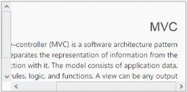

## RTL

EnableRTL API provides right-to-left functionality and features for languages that work in a right-to-left for selecting, editing. Arabic and Hebrew are written from right to left. If you have a working style from right to left, you can use this feature in scroller. You can achieve this in your Scroller by using EnableRTL property. Setting this property to true, the Scroller content text is displayed in the right to left format. The vertical scrollbar move to right to left side.

The following steps explains you the configuration of EnableRTL property in Scroller.

In the View page, add a scroller helper to configure Scroller widget.

[CSHTML]

// In the CSHTML page, add a &lt;div&gt; element to configure Scroller widget and initialize the control.

&lt;div id="scrollcontent"&gt;

  &lt;div&gt;                              @*Wrapper div for Scroller.*@

     &lt;div id="innercontent"&gt;         @*Content div*@

        <h3>MVC &lt;/h3&gt;

         &lt;p&gt;

           Model–view–controller (MVC) is a software architecture pattern which   

           separates the representation of information from the user's interaction

           with it. The model consists of application data, business rules, logic, and

           functions. A view can be any output representation of data, such as a chart

           or a diagram.

         &lt;/p&gt;

    &lt;/div&gt;

  &lt;/div&gt;

&lt;/div&gt;

@{Html.EJ().Scroller("scrollcontent").Height(170).Width(350).EnableRTL(true).Render();}

The following screenshot displays the Scroller control in RTL direction.

{  | markdownify }
{:.image }

_Figure_ _8__: Scroller control in RTL direction_

