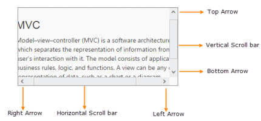

# Scroller Styles

The Essential ASP.NET MVCScroller control allows you to customize the look and function of scrollbars. You can vary it significantly by setting the scrollbar button size, scrollbar position, height and width of the Scroller control. This section describes you the custom styles to be used when creating Scroller.

### Button Size

In Scroller control, it allows you to customize the scroll arrows width and height. In horizontal scroller the ButtonSize customizes the top and down arrow and in vertical scroller the ButtonSize customizes the left and right arrow.

### Scroller Size

The ScrollerSize property is used to customize the scrollbar width and height. It is applicable for both horizontal and vertical scroller.

### Scroll Top

The ScrollerTop property is used to move the Scroller content and scrollbars in top position with the specified value. It is used for only vertical scroller.

### Scroll Left

The ScrollerLeft property is used to move the Scroller content and scrollbars in left position with the specified value. It is used for only horizontal scroller.

### Height

The Height property is used to set the height for Scroller outer wrapper.

### Width

The width property is used to set the Width for Scroller outer wrapper.

In the View page, add the Scroller helper to configure Scroller widget.



// In the CSHTML page, add a 
 element to configure Scroller widget and initialize the control.

  
 @*Wrapper div for Scroller.*@

     
 @*Content div*@

        <h3>MVC </h3>

         

           Model–view–controller (MVC) is a software architecture pattern which   

           separates the representation of information from the user's interaction

           with it. The model consists of application data, business rules, logic, and

           functions. A view can be any output representation of data, such as a chart

           or a diagram.

         

    

  

@{Html.EJ().Scroller("scrollContent").Height(170).Width(350).ScrollTop(10).ScrollLeft(20).ButtonSize(20).Render();}



1. Configure the styles 

   ~~~ css

	

   ~~~
   

The following screenshot displays the Scroller control with basic styles

Scroller control rendered with basic styles
{:.caption}