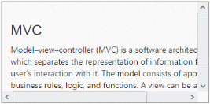

# Thumb Scrolling

Normally the scrollbar position can be changed by dragging the scrollbar handle or clicking the arrows. The Scroller control allows you for panning or dragging the scroll content area to drag by dragging inside the scroll content. To achieve this in your Scroller control, enable the EnableTouchScroll to true_._ By default the value for__EnableTouchScroll is true. When you want to prevent the panning or dragging the scroll content area, set EnableTouchScroll as false.

The following steps explains you the configuration of EnableTouchScroll property in Scroller. 

1. In the View page, add a scroller helper to configure the EnableTouchScroll property.

   ~~~ cshtml

	// In the CSHTML page, add a 
 element to configure Scroller widget and initialize the control.

	

		
 @*Wrapper div for Scroller.*@

			
  @*Content div*@

				<h3>MVC </h3>

				

					Model–view–controller (MVC) is a software architecture pattern which   

					separates the representation of information from the user's interaction

					with it. The model consists of application data, business rules, logic, and

					functions. A view can be any output representation of data, such as a chart

					or a diagram.

				

			

		

	

	@{Html.EJ().Scroller("scrollContent").Height(170).Width(350).EnableTouchScroll(false).Render();}

   ~~~
   

	The following screenshot displays Scroller control with disabled touch support.

	

	Scroller control with disabled touch support
	{:.caption}