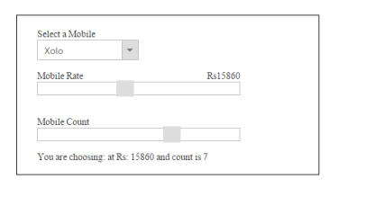
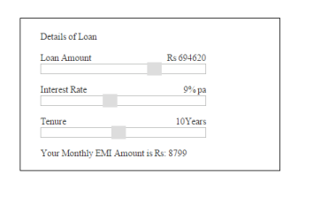

# Getting Started 

This section explains briefly about how to create a Slider in your application with ASP.NET MVC.

## Create your first Slider in MVC

ASP.NET MVC Slider provides support to display a Slider within the webpage. The following section explains you on how to use Sliders in a real-time application to select a mobile model within specified range in Mobile Purchase.

The following screenshot illustrates the functionality of Slider control. You can select a mobile model in the dropdown to purchase it at any rate specified in the Mobile RateSlider and you can also specify the number of mobiles you need by selecting the Mobile CountSlider. Simultaneously, you can observe the change in mobile rate and count using Sliders.

{  | markdownify }
{:.image }

Create a Slider

ASP.NET MVC Slider controlallows you to switch between different ranges of input. The basic Slider is horizontal and has a single handle that can be moved with the mouse or by using the arrow keys. You can easily create the Slider control using @Html.helper as follows.

1. Create an MVC Project and add necessary assembly, scripts, and styles to it.

Refer [MVC-Getting Started](http://help.syncfusion.com/ug/js/Documents/gettingstartedwithmv.htm)

2. Add the following code example for Slider to the corresponding view page.

&lt;div class="frame"&gt;

    &lt;div class="inner"&gt;

&lt;div class="ctrllabel"&gt;

        Select a Mobile

    &lt;/div&gt;    @Html.EJ().DropDownList("selectMobile").TargetID("mobileList").Width("150px")

    &lt;div id="mobileList"&gt;

        &lt;ul&gt;

            <li>Nokia Lumia</li>

            <li>Nokia Asha</li>

            <li>Xolo</li>

            <li>Samsung Galaxy</li>

            <li>Moto G</li>

        &lt;/ul&gt; 

    &lt;/div&gt;

        &lt;span class="columnleft"&gt;

        Mobile Rate

    &lt;/span&gt;

    &lt;span class="columnright"&gt;

        Rs &lt;/span&gt;&lt;span class="value"&gt;&lt;/span&gt;

&lt;/span&gt;    

@Html.EJ().Slider("rateSlider").Height("20px").Value("100").MinValue(5000).MaxValue(30000).IncrementStep(20).ClientSideEvents(evt => evt.Change("onchange").Slide("onchange"))

&lt;span class="Columnleft"&gt;

            Mobile Count

        &lt;/span&gt;        @Html.EJ().Slider("countSlider").Height("20px").Value("1").MinValue(1).MaxValue(10).IncrementStep(1).ClientSideEvents(evt => evt.Change("onchange").Slide("onchange"))

        You are choosing:

        &lt;span id="EventLog"&gt;&lt;/span&gt;

       &lt;/div&gt;

&lt;/div&gt;

3. Add the following styles for Sliders.

&lt;style&gt;

.frame

{

    width:400px;

    height:200px;

    border:1px solid black;

    margin-right:100px;

}

.ctrllabel, .loan

{

    font-weight:bold;

}

.columnright

{

    font-weight:bold;

    float:right;

}

.inner

{

    width:300px;

    height:150px;

    padding:20px 40px 20px 30px;

 } 

.mobileList

    {

        display:block;

    }

&lt;/style&gt;

4. Add the following script to the Slider.

&lt;script&gt;

            var mobileObj, rateObj, countObj;

            function onchange(args) {

                $('#' + args.id).parent().prev().find('.value').html(args.value)

                show();

            }

            function show() {

                selectObj = $('#selectMobile').data('ejDropDownList');

                rateObj = $('#rateSlider').data('ejSlider');

                countObj = $('#countSlider').data('ejSlider');

                var x = selectObj.getValue();

                var y = rateObj.getValue();

                var z = countObj.getValue();

     $('#EventLog').html("\n" + x + "\n" + "at Rs: " + y + "\n" + "and count is " + z);

}

&lt;/script&gt;

5. The following screenshot displays the final output in Slider creation.

{  | markdownify }
{:.image }

EMI Calculator

This section explains how to use the Slider control for EMI Calculation. The final result of EMI amount is calculated automatically based on the loan amount, interest rate and tenure amount based on the amount you choose using Slider.

1. You can create an MVC Project and add necessary &lt;DLL&gt; and script to it.  Refer MVC-Getting Started Documentation.
2. Add the following code for Slider to the corresponding view page.

&lt;div class="frame"&gt;

    &lt;div class="inner"&gt;

        &lt;div id="loanheading"&gt;

            Details of Loan

        &lt;/div&gt;

        &lt;span class="columnleft"&gt;

            Loan Amount

        &lt;/span&gt;

        &lt;span class="columnright"&gt;

            Rs &lt;/span&gt;25000

        &lt;/span&gt;    @Html.EJ().Slider("loanSlider").Height("16px").Value("25000").MinValue(10000).MaxValue(1000000).IncrementStep(10).ClientSideEvents(evt => evt.Change("onchange").Slide("onchange"))

        &lt;span class="columnleft"&gt;

            Interest Rate

        &lt;/span&gt;

        &lt;span class="columnright"&gt;

            &lt;span class="value"&gt;&lt;/span&gt;&lt;span&gt;% pa

        &lt;/span&gt;        @Html.EJ().Slider("interestSlider").Height("16px").Value("4").MinValue(1).MaxValue(20).IncrementStep(1).ClientSideEvents(evt => evt.Change("onchange").Slide("onchange"))

        &lt;span class="columnleft"&gt;

            Tenure

        &lt;/span&gt;

        &lt;span class="columnright"&gt;

            &lt;span class="value"&gt;&lt;/span&gt;Years

        &lt;/span&gt;        @Html.EJ().Slider("tenureSlider").Height("16px").Value("3").MinValue(1).MaxValue(20).IncrementStep(1).ClientSideEvents(evt => evt.Change("onchange").Slide("onchange")) 

            Your Monthly EMI Amount is

            &lt;span id="EventLog"&gt;&lt;/span&gt;

        &lt;/div&gt;

    &lt;/div&gt;

&lt;/div&gt;

3. Include the following styles for Slider.

&lt;style&gt;

.frame

{

    width:350px;

    height:200px;

    border:1px solid black;

}

.inner

{

     width:250px;

    height:150px;

    padding:20px 30px;

}

#loanheading

{

font-weight:bold;

}

.columnleft

{

    font-weight:bold;

}

.columnright

{

    float:right;

    font-weight:normal;

}

&lt;/style&gt;

4. Include the following script to calculate the EMI amount.

&lt;script type="text/javascript"&gt;

            var loanObj, interestObj, tenureObj;

            function onchange(args) {

                $('#' + args.id).parent().prev().find('.value').html(args.value)

                calculate();

            }

            function calculate() {

                loanObj = $('#loanSlider').data('ejSlider');

                interestObj = $('#interestSlider').data('ejSlider');

                tenureObj = $('#tenureSlider').data('ejSlider');

                var loan = loanObj.getValue(), interest = interestObj.getValue(), tenure = tenureObj.getValue();

                var P = loan;

                var y = interest / 1200;

                var tenureamt = tenure * 12;

                //actual processing

                var top = y * (Math.pow((1 + y), tenureamt));

                var bottom = (Math.pow((1 + y), tenureamt)) - 1;

                var ans = top / bottom;

                var final = P * ans;

                var z = Math.round(final);

                $('#EventLog').html("Rs: " + z);

            }

        &lt;/script&gt;

The following screenshot displays the calculated EMI amount using Slider.

{  | markdownify }
{:.image }

The Slider component lets you to select a value such as number, percentage by moving the slider handle. It also allows you to specify a range of values between its minimum and maximum values. You can use Slider to influence other object. For example, Slider can be associated with a picture so that the picture enlarges or shrinks based upon the value in the slider.

The Slider has horizontal orientation by default. You can also change the orientation as vertical. Also, the Slider contains features like enabling slider of different types, enabling scale in the slider etc.

