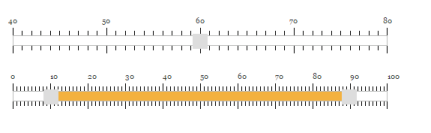
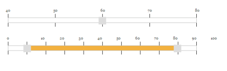
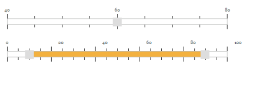

## Scale Settings

Slider widget includes option to display the scale on the Slider. Scale in Slider supports you to easily identify the current value/values of the Slider. Scale contains “small ticks” and “large ticks”. Values of the Slider is displayed above each large ticks.

Show Scale

This property enables the scale in the Slider. By default, its value is “false”. Data type of this property is “Boolean”.

The following steps explains you the configuration of ShowScale property.

1. In an VIEW page, specify the helper elements to render the “Default Slider” and “Range Slider”.

[_cshtml]

/ / Add this code in your view page

@(Html.EJ().Slider("defaultSlider").Value("60").Width("500").MinValue(40).MaxValue(80).ShowScale(true))

    @(Html.EJ().Slider("rangeSlider").SliderType(SlideType.Range).Values("10,90")

    .ShowScale(true))

Execute the above code example to render the following output.

{  | markdownify }
{:.image }

Enable Small Ticks

Slider widget provides you an option to enable/disable the small ticks present in the scale. By default, when you enable “ShowScale” property, small ticks is displayed in the scale. Use the ShowSmallTicks property to disable the small ticks present in the scale. Data type of this property is “Boolean”.

The following steps explains you on how to disable the small ticks in Slider.

1. In an VIEW page, specify the helper elements to render the “Default Slider” and “Range Slider”.

[_cshtml]

/ / Add this code in your view page

@(Html.EJ().Slider("defaultSlider").Value("60").Width("500").MinValue(40).MaxValue(80)

.ShowScale(true).ShowSmallTicks(false))

@(Html.EJ().Slider("rangeSlider").SliderType(SlideType.Range).Values("10,90")

.ShowScale(true).ShowSmallTicks(false))

Execute the above code example to render the following output.

{  | markdownify }
{:.image }

Small step

This property specifies the distance between the two small ticks present in the scale and the position of the small ticks in the Slider scale. Data type of this property is “Number”.

Large step

This property specifies the distance between the two small ticks present in the scale and the position of the large ticks in the Slider scale. Data type of this property is “Number”.

The following steps explains you on how to configure the SmallStep and LargeStep property in Slider scale.

1. In an VIEW page, specify the helper elements to render the “Default Slider” and “Range Slider”

[_cshtml]

/ / Add this code in your view page

@(Html.EJ().Slider("defaultSlider").Value("60").Width("500").MinValue(40).MaxValue(80)

    .ShowScale(true).SmallStep(5).LargeStep(20))

    @(Html.EJ().Slider("rangeSlider").SliderType(SlideType.Range).Values("10,90")

    .ShowScale(true).SmallStep(5).LargeStep(20))

Execute the above code example to render the following output.

{  | markdownify }
{:.image }

In the above example, for “Default Slider” the “SmallStep” value is specified as “5”, so for each 5 values from the starting value, small ticks is enabled. Also, “LargeStep” value is specified as “20”, so for each 20 values from the starting value, large ticks is enabled.

Similarly for “Range Slider”, “SmallStep” value is specifies as “5”, so for each 5 values from the starting value, small ticks is enabled. Also, “LargeStep” value is specified as “25” so, for each 25 values large ticks is enabled.

