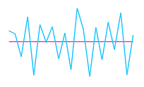

## Axis Customize 

The Sparkline axis can be collapsed using visible property in `AxisLineSettings` and this not applicable for win-loss. You can customize `Color`, `Width` and `DashArray` of axis line.

 
 
 @(Html.EJ().Sparkline("container")

 //To customize the axis line of the sparkline
 .AxisLineSettings(as => as.Visible(true).Color("#ff14ae"))
 
 )



