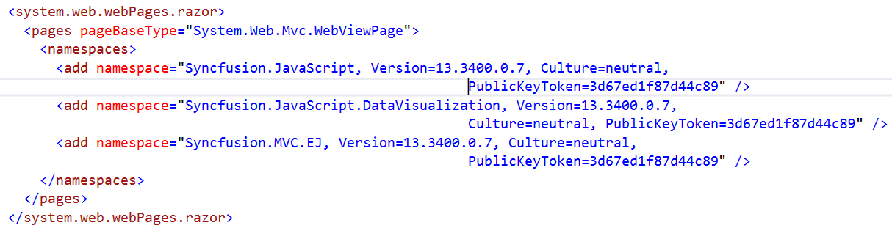

# Getting Started

This section explains you the steps required to populate the Sparkline with data. This section covers only the minimal features that you need to know to get started with the Sparkline.

## Installation and Deployment

It describes you on how to configure the Syncfusion dependencies in your ASP.NET MVC application to create a Sparkline.

### Referencing Syncfusion Assemblies

The following assemblies need to be referenced in your application for using Essential Sparkline MVC

1. Syncfusion.EJ.dll
2. Syncfusion.EJ.MVC.dll

Follow the steps given below to deploy the application in the development server by referencing the assembly in **GAC**.

* Web.config file should be configured according to the referenced assemblies. 
* To deploy your application, you have to ensure that the above referenced assemblies (in your web.config files) are present in the GAC.

And, add Syncfusion namespace in the Web.config file of Views folder to generate SunburstChart builder code in View page.

 

N> If you are referring Syncfusion dll's manually from bin folder to create MVC SunburstChart, then remove Culture, Version and PublicKeyToken attributes used in all, and nodes.

###  Adding script reference

Add the below scripts references and Syncfusion **ScriptManager** to execute the script as mentioned in the following code snippet in layout page.



    <!--  jquery script  -->
    
    
    <!-- Essentialcshtml UI widget -->
    
    
    <!--Add Syncfusion Script Manager -->
    @Html.EJ().ScriptManager()



To render the MVC Chart in unobtrusive mode refer **ej.unobtrusive.js** script file. Otherwise set false to **UnobtrusiveJavaScriptEnabled** in Web.config file.

In the above code, ej.web.all.min.js script reference has been added for demonstration purpose. It is not recommended to use this for deployment purpose, as its file size is larger since it contains all the widgets. Instead, you can use [`CSG`](http://csg.syncfusion.com/) utility to generate a custom script file with the required widgets for deployment purpose.

## Initialize Sparkline

Add the following code in the index.cshtml file to create the Sparkline control in View page.



    @(Html.EJ().Sparkline("sparklineContainer"))



Now, the Sparkline is rendered with some auto-generated random values and with default Line type Sparkline.

