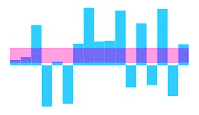

## Range Band  

The range band feature is used to highlight a particular range along the y-axis using `StartRange` and `EndRange` property. You can also customize the `Color` and `Opacity` of the `RangeBandSettings`. 



@(Html.EJ().Sparkline("container")

 //To customize the range Band of the sparkline
  .RangeBandSettings(range => range.StartRange(4).EndRange(30).Color("#ff14ae").Opacity(0.4))
 )



