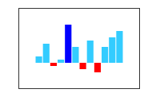
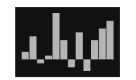

# Sparkline Customization

This section explains you the customization options available to make changes in the Sparkline for getting better appearance.

## Sparkline background

You can specify the background color for the Sparkline using `Background` property. When you don't specify the `Background`, it takes "transparent" as background color. 



@(Html.EJ().Sparkline("container")

            //Specifies background color for sparkline
            .Background("gray")
            // ...
 )

 

## Stroke color and width

You can customize the series border color and width using `Stroke` and `Width`. This is applicable for Sparkline types line and area.



@(Html.EJ().Sparkline("container")
            // ...
            //Specifies border color and width for line and area series
            .Stroke("green")
            .Width(3)
            // ...
)

 

## Sparkline border

You can customize the `Border` color and width of the Sparkline using `Color` and `Height` properties. This is applicable for column, win-loss and pie series.



@(Html.EJ().Sparkline("container")
            // ...
            //Specifies border width and color for column, winLoss and pie series
            .Border(border=>border.Color("green").Width(2))
            // ...
)

 

## Opacity

By default `Opacity` of the Sparkline is 1. You can specify the opacity value from 0 to 1. This is applicable for all types of series. 



@(Html.EJ().Sparkline("container")
            // ...
            //Specifies the opacity of the sparkline
            .Opacity(0.5)
            // ...
)

 

## Padding for Sparkline

`Padding` is used to specify the padding value between the container and Sparkline. By default padding value of the Sparkline is 5. 



@(Html.EJ().Sparkline("container")
            // ...
            //Padding for the sparkline
            .Padding(20)
            // ...
)

 

## Canvas support

You can control whether Sparkline has to be rendered as SVG or Canvas. `EnableCanvasRendering` property supports all the functionalities supported in SVG rendering.



@(Html.EJ().Sparkline("container")
            // ...
            //enables canvas rendering
            .EnableCanvasRendering(true)
            // ...
)

 

## Themes

You can specify different `Theme` for Sparkline control.



@(Html.EJ().Sparkline("container")
            // ...
            //theme for sparkline
            .Theme(SparkTheme.FlatDark)
            // ...
)

 

