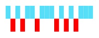
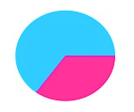

# Sparkline Types

## Line Type

To render a Line type Sparkline, set the `Type` as **line**. To change the color and width of the line, you can use the `Fill` and `Width` property.	



@(Html.EJ().Sparkline("container")

 //To customize the  line type sparkline
.Width(3)
.Fill("#33ccff")
 
 )



## Column Type

To render a Column Sparkline, set the type as **column** To change the color of the column, you can use the `Fill` property.



@(Html.EJ().Sparkline("container")

 //To customize the column type sparkline
.Type(SparklineType.Column)
.Fill("#33ccff")
 
 )



## Area Type

To render an Area Sparkline, you can specify the type as **area**. To change the Area color, you can use the `Fill` property



@(Html.EJ().Sparkline("container")

 //To customize the area type sparkline
.Type(SparklineType.Area)
.Fill("#69D2E7")
 
 )



## WinLoss Type

WinLoss Sparkline render as a column segment and it show the positive, negative and neutral values. You can customize the positive and negative color of the win-loss type.



@(Html.EJ().Sparkline("container")

 //To customize the area type sparkline
.Type(SparklineType.WinLoss)
.Fill("#69D2E7")
 
 )



## Pie Type

You can create a pie type sparkline by setting the type as **pie**. Colors for the pie can be customize using `Palette` property.



@(Html.EJ().Sparkline("container")

 //To customize the area type sparkline
.Type(SparklineType.Pie)
.Palette(pl => { pl.Add("#ff3399"); pl.Add("#33ccff");  })
 
 )



