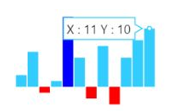
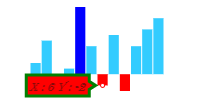
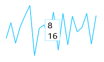

## Tooltip  

The `Tooltip` follows the pointer movement and is used to indicate the value of a point. This feature is applicable for line, column, pie, and area Sparkline. You can enable the tooltip by setting it’s `Visible` property as true. You can customize the tooltip `Fill`, `Border` and `Font`.



@(Html.EJ().Sparkline("container")

.Tooltip(tooltip => tooltip.Visible(true))
 
 )



## Tooltip Customization

You can customize the tooltip `Fill`, `Border` `Color`, `Width` and `Font` properties `Color`, `FontFamily`, `FontStyle`, `FontWeight`, `Opacity` and `Size`



@(Html.EJ().Sparkline("container")
            // ...
    .Tooltip(tooltip => tooltip
                .Fill('red')
                .Border(border=>border.Color('green').Width(3))
                .Font(font=>font.Size('12px').FontFamily('Algerian').FontStyle('Italic').FontWeight('Lighter').Opacity(0.5))
            )
)



## Tooltip Template   

HTML elements can be displayed in the tooltip by using the `Template` option of the tooltip. The template option takes the value of the id attribute of the HTML element. You can use the **#point.x#** and **#point.y#** as place holders in the HTML element to display the x and y values of the corresponding point.



    

        
#point.x#

        
#point.y#

    

@(Html.EJ().Sparkline("container")

.Tooltip(tooltip => tooltip.Visible(true).Template("item"))
 
 )



