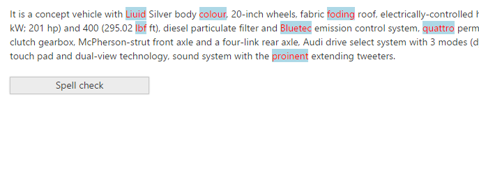
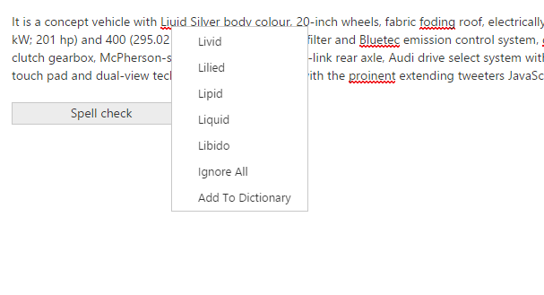

# Customization

The Essential ASP.NET MVC SpellCheck provides option to customize for the following scenarios.

* Misspell Word Appearance
* Restrict Suggestion Count

## Misspell Word Appearance

The SpellCheck control provide the support(misspellWordCss) to display the error word in user defined style. By default displaying the error words with the red underline.
The following code example depicts the way to customize the error word highlight (displaying error word with red color font and lightblue background).



@section ControlsSection{

    It is a concept vehicle with Liuid Silver body colour, 20-inch wheels, fabric foding roof, electrically-controlled hood,
    4-cylinder 2.0 TDI engine rated 204 PS (150 kW; 201 hp) and 400 (295.02 lbf ft), diesel particulate filter and Bluetec emission control system,
    quattro permanent four-wheel drve system, Audi S tronic dual-clutch gearbox, McPherson-strut front axle and a four-link rear axle, Audi drive select system with 3 modes (dynamic, sport, efficiency),
    MMI control panel with touch pad and dual-view technology, sound system with the proinent extending tweeters.

 
 
    @Html.EJ().SpellCheck("TextArea").DictionarySettings(dictionary => dictionary.CustomDictionaryUrl("../api/SpellCheck/AddToDictionary").DictionaryUrl("../api/SpellCheck/CheckWords")).MisspellWordCss("highlight")
 
 
    @Html.EJ().Button("SpellCheck").Width("200px").Height("25px").Text("Spell check").ClientSideEvents(evet => evet.Click("contextMenu"))
}
 
@section ScriptSection{
    
}
@section StyleSection{

}



Once you have run the above code, you get an output like below.

 
 
## Restrict Suggestion Count

The SpellCheck control provides option (maxSuggestionCount) to restrict the count that the number of items displayed in the suggestion list.
The following code example describes the way to control the suggestion count.



@section ControlsSection{

    It is a concept vehicle with Liuid Silver body colour, 20-inch wheels, fabric foding roof, electrically-controlled hood,
    4-cylinder 2.0 TDI engine rated 204 PS (150 kW; 201 hp) and 400 (295.02 lbf ft), diesel particulate filter and Bluetec emission control system,
    quattro permanent four-wheel drve system, Audi S tronic dual-clutch gearbox, McPherson-strut front axle and a four-link rear axle, Audi drive select system with 3 modes (dynamic, sport, efficiency),
    MMI control panel with touch pad and dual-view technology, sound system with the proinent extending tweeters.

 
 
    @Html.EJ().SpellCheck("TextArea").DictionarySettings(dictionary => dictionary.CustomDictionaryUrl("../api/SpellCheck/AddToDictionary").DictionaryUrl("../api/SpellCheck/CheckWords")).MaxSuggestionCount(5)
 
 
    @Html.EJ().Button("SpellCheck").Width("200px").Height("25px").Text("Spell check").ClientSideEvents(evet => evet.Click("contextMenu"))
}
 
@section ScriptSection{
    
}



Once you have run the above code, you get an output like below.

 