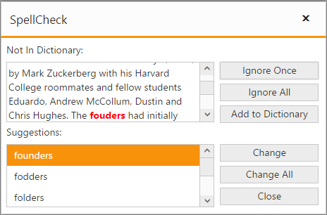

# Getting Started

 This section explains briefly about how to create a SpellCheck Control in your application with ASP.NET MVC

## Create your first SpellCheck in MVC

 Create a ASP.NET MVC Project and add necessary assemblies, CSS and scripts with the help of the given MVC-Getting Started documentation. After creating this project, you can create a SpellCheck in following ways.

## SpellCheck Using Helper element

In the view page, add SpellCheck helper as shown below.



@Html.EJ().SpellCheck("TextArea")



## Service Reference

 Assign the service method (CheckWords) path reference to the property dictionaryUrl, which is mandatory to check the spelling of the word.
The CheckWords method will perform the splitting of target sentence into separate words and check each word is that an erroneous or not. If the word is erroneous fetching the possible suggestions for it and returns those details as a result.



@Html.EJ().SpellCheck("TextArea").DictionarySettings(dic => dic.CustomDictionaryUrl("../api/SpellCheck/AddToDictionary").DictionaryUrl("../api/SpellCheck/CheckWords"))



## Spell Checking

 To spell check the content of the target element, you need to add one button and calling any one of the spellcheck method showInDialog or validate by clicking the button to highlight the error words.
The following code example depicts that checking the spelling of the target element through the showInDialog method.



@section ControlsSection{ 

    Facebook is a social networking service headquartered in Menlo Park, California. Its website was launched on February 4, 2004, by Mark Zuckerberg with his Harvard College roommates and fellow students Eduardo, Andrew McCollum, Dustin and Chris Hughes.
    The fouders had initially limited the websites membrship to Harvard students, but later expanded it to collges in the Boston area, the Ivy League, and Stanford Univrsity. It graually added support for students at various other universities and later to high-school students.

 
 
   @Html.EJ().SpellCheck("TextArea").DictionarySettings(dic => dic.CustomDictionaryUrl("../api/SpellCheck/AddToDictionary").DictionaryUrl("../api/SpellCheck/CheckWords"))
 
   @Html.EJ().Button("SpellCheck").Width("200px").Height("25px").Text("Spell check using dialog").ClientSideEvents(evet => evet.Click("showDialog"))
 
}
@section ScriptSection{

    
}



Once you have completed the above steps, you will get an output like below.
 
 

## Dependencies

To render the SpellCheck control, the following list of external dependencies are needed, 

* [jQuery](http://jquery.com) - 1.7.1 and later versions

The other required internal dependencies are tabulated below,

<table>
<tr>
<th>
File  </th><th>
Description/Usage  </th></tr>
<tr>
<td>
ej.core.min.js  </td><td>
Must be referred always first before using all the JS controls.  </td></tr>
<tr>
<td>
ej.data.min.js  </td><td>
Used to handle data operation and should be used while binding data to JS controls.  </td></tr>
<tr>
<td>
ej.spellcheck.min.js  </td><td>
SpellCheck core script file.  </td></tr>
<tr>
<td>
ej.unobtrusive.min.js  </td><td>
Used to create our SpellCheck component with basic level HTML tag-like structure.  </td></tr>
<tr>
<td>
ej.scroller.js  ej.button.js  ej.dialog.js  ej.menu.js  ej.listbox.js  ej.draggable.js  ej.globalize.js  </td><td>
These files are referred for proper working of the sub-controls used within SpellCheck.  </td></tr>
</table>

N> SpellCheck uses one or more sub-controls, therefore refer the `ej.web.all.min.js` (which encapsulates all the `ej` controls and frameworks in a single file) in the application instead of referring all the above specified internal dependencies. 

To get the real appearance of the SpellChecker, the dependent CSS file `ej.web.all.min.css` (which includes styles of all the widgets) should also needs to be referred.

