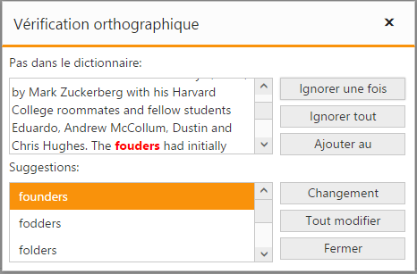

# Localization

SpellCheck dialog mode comes with default localization support which allows it to customize the display of text within the SpellCheck dialog in a user-specific culture and locale. The SpellCheck control can be localized in specific culture using the common API [locale](/api/js/ejspellcheck#members:locale) along with the collection of localized words defined for that culture using the ej.SpellCheck.Locale [**culture-code**].

By default, the SpellCheck control is localized in **en-US** culture. Please find the following table lists the default keywords and its localized text values for en-US culture.

<table>
        <tr>
            <th>
                Locale key words </th>
            <th>
                Text
            </th>
        </tr>
        <tr>
            <td>
                SpellCheckButtonText
            </td>
            <td>
                SpellCheck
            </td>
        </tr>
        <tr>
            <td>
                NotInDictionary
            </td>
            <td>
                Not in Dictionary
            </td>
        </tr>
        <tr>
            <td>
                SuggestionLabel
            </td>
            <td>
                Suggestions
            </td>
        </tr>
        <tr>
            <td>
                IgnoreOnceButtonText
            </td>
            <td>
                Ignore Once
            </td>
        </tr>
        <tr>
            <td>
                IgnoreAllButtonText
            </td>
            <td>
                Ignore All
            </td>
        </tr>
        <tr>
            <td>
                AddToDictionary
            </td>
            <td>
                Add to Dictionary
            </td>
        </tr>
        <tr>
            <td>
                ChangeButtonText
            </td>
            <td>
                Change
            </td>
        </tr>
        <tr>
            <td>
                ChangeAllButtonText
            </td>
            <td>
                Change All
            </td>
        </tr>
        <tr>
            <td>
                CloseButtonText
            </td>
            <td>
                Close
            </td>
        </tr>
        <tr>
            <td>
                CompletionPopupMessage
            </td>
            <td>
                Spell check is complete
            </td>
        </tr>
        <tr>
            <td>
                CompletionPopupTitle
            </td>
            <td>
                Spell check alert
            </td>
        </tr>
        <tr>
            <td>
                OK
            </td>
            <td>
                OK
            </td>
        </tr>
        <tr>
            <td>
                NoSuggestionMessage
            </td>
            <td>
                No suggestions available
            </td>
        </tr>
</table>

To localize SpellCheck into any particular culture, it is necessary to refer the culture-specific script files in your application after the reference of **ej.web.all.min.js** file, which are available under the following location.                   

_<**Installed location**>\Syncfusion\Essential Studio\{{ site.releaseversion }}\JavaScript\assets\scripts\i18n_

The following code example shows how to localize the SpellCheck control in **fr-FR** culture.



@section ControlsSection{
    

        Facebook is a social networking service headquartered in Menlo Park, California. Its website was launched on February 4, 2004, by Mark Zuckerberg with his Harvard College roommates and fellow students Eduardo, Andrew McCollum, Dustin and Chris Hughes.
        The fouders had initially limited the websites membrship to Harvard students, but later expanded it to collges in the Boston area, the Ivy League, and Stanford Univrsity. It graually added support for students at various other universities and later to high-school students.
    
 
 
    @Html.EJ().SpellCheck("TextArea").DictionarySettings(dic => dic.CustomDictionaryUrl("../api/SpellCheck/AddToDictionary").DictionaryUrl("../api/SpellCheck/CheckWords")).Locale("fr-FR")
 
    @Html.EJ().Button("SpellCheck").Width("200px").Height("25px").Text("Spell check using dialog").ClientSideEvents(evet => evet.Click("showDialog"))
 }
 
@section ScriptSection{
    
}



 

N> Refer the **ej.culture.fr-FR.min.js** file in your HTML application and also define the **locale** property for the SpellCheck control with the appropriate **culture-code** [**fr-FR**].

For further information on how to refer the required culture scripts into your application, refer [here](/js/localization).

### Localizing Specific Words

To customize or localize only some specific words in the default ej.SpellCheck.Locale["en-US"] collection, the words to be localized/customized can be defined in a separate variable and then extended to the original collection as depicted in the following code example.



@section ControlsSection{
    

        Facebook is a social networking service headquartered in Menlo Park, California. Its website was launched on February 4, 2004, by Mark Zuckerberg with his Harvard College roommates and fellow students Eduardo, Andrew McCollum, Dustin and Chris Hughes.
        The fouders had initially limited the websites membrship to Harvard students, but later expanded it to collges in the Boston area, the Ivy League, and Stanford Univrsity. It graually added support for students at various other universities and later to high-school students.
    
 
 
    @Html.EJ().SpellCheck("TextArea").DictionarySettings(dic => dic.CustomDictionaryUrl("../api/SpellCheck/AddToDictionary").DictionaryUrl("../api/SpellCheck/CheckWords")).Locale("fr-FR")
 
    @Html.EJ().Button("SpellCheck").Width("200px").Height("25px").Text("Spell check using dialog").ClientSideEvents(evet => evet.Click("showDialog"))
 }
 
@section ScriptSection{

    
}


