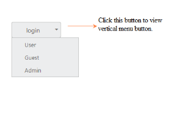

# Dropdown Button

You can change the Split Button as Dropdown Button that consists of a single button that when clicked displays a drop-down list of mutually exclusive items. You can achieve this by using default functionality of Split Button with ButtonMode as ButtonMode.Dropdown. Initially the TargetID is a mandatory one.

The following steps explain how to change the Split Button as Dropdown Button.

1. In the VIEW page, add the following button elements to configure Button widget.


[CSHTML]

@*Add the code in the CSHTML page to configure and initialize the control*@

@Html.EJ().SplitButton("dropdownbtn").Text("login").ShowRoundedCorner(true).Size(ButtonSize.Medium).ContentType(ContentType.TextOnly).TargetID("menu1").ButtonMode(ButtonMode.Dropdown)

<ul id="menu1">

    <li>User</li>

    <li>Guest</li>

    <li>Admin</li>

</ul>



2. Execute the above code to render the following output.

{{ '' | markdownify }}

