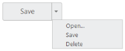

# Getting Started 

This section explains briefly about how to create a Split Button in ASP.NET MVC application.

## 1.2.1 Create your first Split Button in MVC

The HTML button element and the <UL>, <LI> can be easily configured as Essential ASP.NET MVC Split Button control.  The basic rendering of Essential ASP.NET MVC Split Button is achieved by using default functionality. Initially the TargetID is a mandatory one, without this field it acts as normal button on two sides.

### Create Split Button Control in MVC

Essential ASP.NET MVC Split Button control contains built-in features such as Click and different option choosing. You can easily create the Split Button control by using HTML helper as follows.

1. You can create an MVC Project and add necessary assemblies, styles and scripts to it.  Refer [MVC-Getting Started.](http://docs.syncfusion.com/aspnetmvc/splitbutton/getting-started)
2. Add the following code to the corresponding View page to render Split Button.

   ~~~ js

	@Html.EJ().SplitButton("sbutton").Text("Save").ShowRoundedCorner(true).Size(ButtonSize.Large).TargetID("target")

   ~~~
   {:.prettyprint }

3. Add the following <UL>, <LI> elements to render Split Button with popup option.

   ~~~ html
   
       <ul id="target">

            <li>Open</li>

            <li>Save</li>

            <li>Delete</li>

        </ul>      

   ~~~
   {:.prettyprint }

Output of the above scripts,

