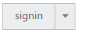
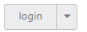

# Miscellaneous

## Text

It is necessary to display the user defined text for Split Button. Using Text property, you can easily set text content for Split Button.

The following steps explains you the details about rendering the Split Button with specified text.

1. In the VIEW page, add the following button elements to configure Split Button widget


[CSHTML]

//Add the code in the CSHTML page to configure and initialize the control

    @*Set the text for split button control as follows. *@

    

        @Html.EJ().SplitButton("spltbutton_text").Text("signin").Size(ButtonSize.Small).TargetID("Ul11")

        <ul id="Ul11">

            <li>User</li>

            <li>Guest</li>

            <li>Admin</li>

        </ul>

    



Execute the above code to render the following output.

{{ '' | markdownify }}

## ShowRoundedCorner

Specifies the corner of Split Button in rounded shape. By default, the edges of Split Button is not rounded. To set rounded corner, you can enable ShowRoundedCorner property.

The following steps explains you the details about rendering the Split Button with rounded corner.

1. In the VIEW page, add the following button elements to configure Split Button widget.


[CSHTML]

//Add the code in the CSHTML page to configure and initialize the control

    @*Enable the rounded corner for split button control as follows.*@

    

        @Html.EJ().SplitButton("spltbutton_roundedCorner").Text("login").Size(ButtonSize.Small).ShowRoundedCorner(true).TargetID("Ul11")

        <ul id="Ul11">

            <li>User</li>

            <li>Guest</li>

            <li>Admin</li>

        </ul>

    



Execute the above code to render the following output.

{{ '' | markdownify }}

