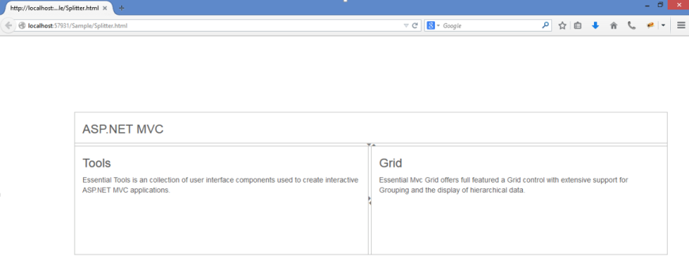
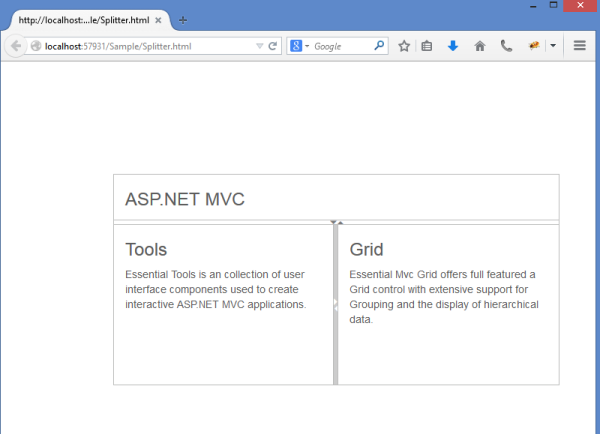
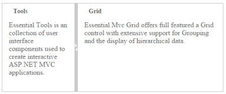
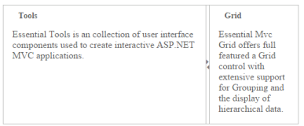
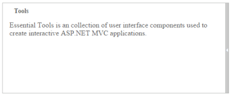
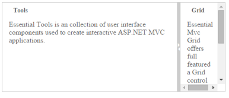
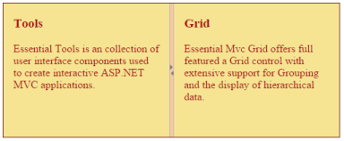

## Appearance and Styling 

Responsive

The EnableAutoResize option allows the Splitter control to adapt its rendering based on the parent container where it is actually placed. When this option is set to true, the Splitter control adjusts its height and width based on the outer container that contains it, and also the sub-elements within it adjust to its height, width and position, appropriately.

Enabling Auto Resize

The following steps explain the implementation of AutoResize option in the Splitter control. 

1. In the View page, add the Splitter helper and configure the ‘EnableAutoResize’ property.

[CSHTML]

        @{Html.EJ().Splitter("outterSplitter").Height("280")

.Width("100%").Orientation(Orientation.Vertical).EnableAutoResize(true)

.PaneProperties(

    p =>

    {

        p.Add().ContentTemplate(

            @&lt;div&gt;

                &lt;div class="content" style="padding: 0px 15px;"&gt;

                    &lt;h3 class="h3"&gt;

                        ASP.NET MVC

                    &lt;/h3&gt;

                &lt;/div&gt;

            &lt;/div&gt;).PaneSize("60");

        p.Add().ContentTemplate(

            @&lt;div style="height: 100%; width: 100%"&gt;

                @innerSplitter()

            &lt;/div&gt;);

    }).Render();}

@helper innerSplitter()

{

    @Html.EJ().Splitter("innerSplitter").EnableAutoResize(true).PaneProperties(p1=>

                {

                    p1.Add().ContentTemplate(@&lt;div&gt;

                        &lt;div class="content"&gt;

                            &lt;h3 class="h3"&gt;

                                Tools

                            &lt;/h3&gt;

                            Essential Tools is an collection of user interface components used to create interactive

                            ASP.NET MVC applications.

                        &lt;/div&gt;

                    &lt;/div&gt;);

                    p1.Add().ContentTemplate(@&lt;div&gt;

            &lt;div class="content"&gt;

                &lt;h3 class="h3"&gt;

                    Grid

                &lt;/h3&gt;

                Essential Mvc Grid offers full featured a Grid control with extensive support for

                Grouping and the display of hierarchical data.

            &lt;/div&gt;

        &lt;/div&gt;);

                });

}

[CSS]

&lt;style type="text/css"&gt;

    #outterSplitter {

        margin: 0 auto;

    }

    .h3 {

        font-size: 14px;

    }

    #innerSplitter {

        border: 0 none;

    }

    .content {

        padding: 15px;

    }

&lt;/style&gt;

The output for Splitter when EnableAutoResize is “True”.

{  | markdownify }
{:.image }

{  | markdownify }
{:.image }

Animation Support

The Splitter provides you animation support when you expand or collapse the pane. The animation speed can be modified by using the AnimationSpeed property, that has values in milliseconds.

Enabling Animation with Animation speed

The following steps explain the implementation of EnableAnimation option in the Splitter widget.

1. In the View page add the Splitter helper to customize the Splitter appearance. 

[CSHTML]

@{Html.EJ().Splitter("Splitter").Height("200").Width("500").EnableAnimation(true).AnimationSpeed(300).PaneProperties(

    p =>

    {

        p.Add().ContentTemplate(

            @&lt;div&gt;

                 &lt;div style="padding: 0px 15px;"&gt;

                     <h3 class="h3">Tools &lt;/h3&gt;

                     Essential Tools is an collection of user interface components used to create interactive

                     ASP.NET MVC applications.

                 &lt;/div&gt;

            &lt;/div&gt;);

        p.Add().ContentTemplate(

            @&lt;div&gt;

                 &lt;div style="padding: 0px 15px;"&gt;

                     <h3 class="h3">Grid &lt;/h3&gt;

                     Essential Mvc Grid offers full featured a Grid control with extensive support for

                     Grouping and the display of hierarchical data.

                 &lt;/div&gt;

            &lt;/div&gt;);

    }).Render();}

The output for Splitter when EnableAnimation is “True”. Expanding or collapsing the outer pane in the Splitter produces the animation effect with the animation speed.

{  | markdownify }
{:.image }

Adjusting Splitter Size

Height

The height of Splitter can be modified by using the Height property. The default value for Height property is null in Splitter. You can set the Height property by pixel or percentage values.

Width

The width of Splitter can be modified by using the Width property. The default value for Width property is null in Splitter. You can set the Width property by pixel or percentage values.

Max Size

Defines the maximum resizable size of the pane when you resize the Splitter widget. The default value of MaxSize is null in Splitter. You can set the MaxSize property by pixel values.

Min Size

Defines the minimum resizable size of the pane when you resize  the Splitter widget. The default value of MinSize is 10 in Splitter. You can set the MinSize property by pixel values.

Pane Size

Defines the pane size in the Splitter widget. The default value of PaneSize is 0px in Splitter. You can set the PaneSize property by pixel or percentage values.

Resizable

Defines whether the pane in the Splitter is resizable or not. Setting the resizable property as “False” disables the resize option to the pane. The default value of Resizable property is true in Splitter.

The following steps explain the implementation of Splitter properties. 

1. In the View page add Splitter helper and configure resizable property of the split pane.

[CSHTML]

@{Html.EJ().Splitter("Splitter").Height("200").Width("500").PaneProperties(

    p =>

    {

        p.Add().ContentTemplate(

            @&lt;div&gt;

                 &lt;div style="padding: 0px 15px;"&gt;

                     <h3 class="h3">Tools &lt;/h3&gt;

                     Essential Tools is an collection of user interface components used to create interactive

                     ASP.NET MVC applications.

                 &lt;/div&gt;

            &lt;/div&gt;);

        p.Add().ContentTemplate(

            @&lt;div&gt;

                 &lt;div style="padding: 0px 15px;"&gt;

                     <h3 class="h3">Grid &lt;/h3&gt;

                     Essential Mvc Grid offers full featured a Grid control with extensive support for

                     Grouping and the display of hierarchical data.

                 &lt;/div&gt;

            &lt;/div&gt;).Collapsible(true).MinSize("100").MaxSize("150").PaneSize("150").Resizable(true);

    }).Render();}

The output for Splitter after adding the properties.

{  | markdownify }
{:.image }

{  | markdownify }
{:.image }

{  | markdownify }
{:.image }

{  | markdownify }
{:.image }

Theme

Splitter control’s style and appearance can be controlled based on CSS classes. In order to apply styles to the Splitter control, refer 2 files namely: ej.widgets.core.min.css and ej.theme.min.css. If the file ej.widgets.all.min.css is referred, then it is not necessary to include the files ej.widgets.core.min.css and ej.theme.min.css in your project, as ej.widgets.all.min.css is the combination of these two. 

By default, there are 12 themes support available for Autocomplete control namely

* default-theme
* flat-azure-dark
* fat-lime
* flat-lime-dark
* flat-saffron
* flat-saffron-dark
* gradient-azure
* gradient-azure-dark
* gradient-lime
* gradient-lime-dark
* gradient-saffron
* gradient-saffron-dark

CSS Class

The CSS properties can be customized by using CssClass in the Splitter widget. The following steps explain the implementation of CssClass option in the Splitter widget.

2. In the View page add the Splitter helper and customize the Splitter appearance. 

[CSHTML]

@{Html.EJ().Splitter("Splitter").Height("200").Width("500").CssClass("customCSS").PaneProperties(

    p =>

    {

        p.Add().ContentTemplate(

            @&lt;div&gt;

                 &lt;div style="padding: 0px 15px;"&gt;

                     <h3 class="h3">Tools &lt;/h3&gt;

                     Essential Tools is an collection of user interface components used to create interactive

                     ASP.NET MVC applications.

                 &lt;/div&gt;

            &lt;/div&gt;);

        p.Add().ContentTemplate(

            @&lt;div&gt;

                 &lt;div style="padding: 0px 15px;"&gt;

                     <h3 class="h3">Grid &lt;/h3&gt;

                     Essential Mvc Grid offers full featured a Grid control with extensive support for

                     Grouping and the display of hierarchical data.

                 &lt;/div&gt;

            &lt;/div&gt;).Collapsible(true).MinSize("100").Resizable(true);

    }).Render();}

1. Customize the CSS class by setting CSS properties. 

[CSS]

    &lt;style&gt;

        .customCSS {            

            border-color: #661e19;

        }

        /*Customize Splitbar*/

        .customCSS .e-splitbar {

            background-color: #f9c89f;

        }

        /*Customize Splitter pane*/

        .customCSS .e-pane {

            color: #b21010;

            background-color: #f6e492;

        }     

    &lt;/style&gt;

The output for Splitter after customizing the CSS class.

{  | markdownify }
{:.image }

