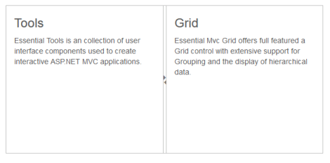
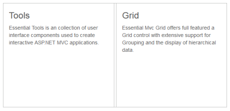

# Enabling Collapsible

The Splitter provides you the option to enable or disable the pane collapse functionality. You can click the icon in Splitbar to collapse or expand the corresponding pane element in Splitter. Setting the Collapsible property to “False” disables the pane collapse functionality in the Splitter widget.

## Configure Collapsible

The following steps explain the implementation of the Collapsible option in Splitter.

1. In the View page, add the Splitter helper and configure the ‘Collapsible’ property as shown below. ‘ContentTemplate’ property is used to specify the HTML tags within the helper elements. Here we have used the contentTemplate property to specify the contents of the splitter control.



@Html.EJ().Splitter("Splitter").Height("280").Width("600").Orientation(Orientation.Horizontal).PaneProperties(

p =>

{

p.Add().ContentTemplate(

	@

		

			<h3 class="h3">Tools </h3>

			Essential Tools is an collection of user interface components used to create interactive

			ASP.NET MVC applications.

		

	
).Collapsible(false);

p.Add().ContentTemplate(

	@

		

			<h3 class="h3">Grid </h3>

			Essential Mvc Grid offers full featured a Grid control with extensive support for

			Grouping and the display of hierarchical data.

		

	
);

})



The output for Splitter when collapsible is set to “True” is as follows.

The output for Splitter when collapsible is “False”.

