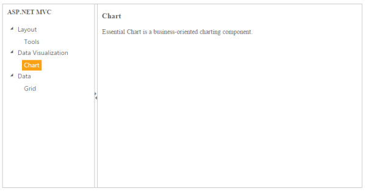

# Getting Started

This section explains briefly about how to create a Splitter in ASP.NET MVC application.

## Create your first Splitter in MVC

ASP.NET MVCSplitter control consists of movable split bar(s) that divides the container's display area into two or more resizable and collapsible panels. Refer the following guidelines to create a Splitter, add tree view in the Splitter and how to set actions to view the image that is used to split the document or image and also Expand or Collapse the Splitter. 

The following screenshot illustrates a Splitter control.

### Create a Splitter

Essential Studio ASP.NET MVC Splitter control has a built-in feature to split the display into horizontal and vertical order.

1. Create an MVC Project and add required assemblies, scripts, and styles to it.  Refer [MVC-Getting Started](http://docs.syncfusion.com/aspnetmvc/splitter/getting-started) Documentation.
2. Add the following code example to the corresponding view page to render the Splitter. You can download the desired mobile and name it as galaxy.jpg. ‘ContentTemplate’ property is used to specify the HTML tags within the helper elements. Here we have used the contentTemplate property to specify the contents of the splitter control.

   ~~~ cshtml

	@{Html.EJ().Splitter("outterSplitter").PaneProperties(p =>

		{

		p.Add().ContentTemplate(

			@

			<h3 class="h3">

				ASP.NET MVC

			</h3>

		@*Add Tree Element here*@

			
).PaneSize("200");

		p.Add().ContentTemplate(

			@

			

				Select any product from the tree to show the description.

			

			

				<h3>

				Tools

				</h3>

				

				Essential Tools is an collection of user interface components used to create interactive

				ASP.NET MVC applications.

				

			

			

				<h3>

				Chart

				</h3>

				
 Essential Chart is a business-oriented charting component.

			

			

				<h3>

				Grid

				</h3>

				

				Essential MVC Grid offers full featured a Grid control with extensive support for

				Grouping and the display of hierarchical data.

				

			

			
).PaneSize("200");

		}).Height("400").Width("100%").Render();}

   ~~~
   

3. Add the following style in the view page to set the height and width of the Splitter.

   ~~~ css

	
   ~~~
   

##Configure Tree View

Add the following code example in the corresponding view page. ‘HtmlAttributes’ property is used to add HTML attributes like, id, class etc.. to the components. We need to use IDictionary<string, object> to specify the HTML attributes. Please check the below code.



@{IDictionary<string, object> htmlAttribute = new Dictionary<string, object>();

htmlAttribute.Add("class", "_child");

}

@Html.EJ().TreeView("treeview").Items(items =>

{

items.Add().Text("Layout").Expanded(true).Children(child =>

{

	child.Add().Id("tools").Text("Tools").HtmlAttributes(htmlAttribute);

});

items.Add().Text("Data Visualization").Expanded(true).Children(child =>

{

   child.Add().Id("chart").Text("Chart").HtmlAttributes(htmlAttribute);

});

items.Add().Text("Data").Expanded(true).Children(child =>

{

	child.Add().Id("grid").Text("Grid").HtmlAttributes(htmlAttribute);

});

}).ClientSideEvents(e => e.NodeSelect("treeClicked"))



## Set Actions to Splitter control to view the image

Add the following code example in the view page to set action in Splitter control to view the image.




Execute the above code example to render the following output.

