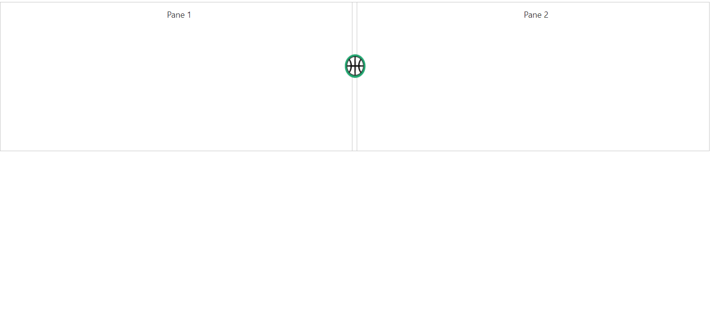

# How To?

### Change Expand/Collapse icons

By default, you are provided with collapse/expand icons in **Split bar** to collapse or expand the splitter panes. We have provided template support to replace existing expand/collapse icons.

* **expanderTemplate** Specifies HTML element string to replace template with existing expand/collapse icons. 

* **clickOnExpander** event is triggered when we click on the template icon.`



   @Html.EJ().Splitter("innerSplitter").PaneProperties(p1 =>
   {
   p1.Add().ContentTemplate(@

            

                Pane 1
            

        
);
   p1.Add().ContentTemplate(@

            

                Pane 2
            

        
);
   }).Height("250").Width("80%").ExpanderTemplate("").ClientSideEvents(cs => cs.ClickOnExpander("onClick"))









        .cont {
            padding: 10px 0 0 10px;
            text-align: center;
        }   
         .eimg {
            height:40px;
            width:35px;
			margin-left: -13px;
        }  
       .e-splitter .e-splitbar .e-splitter-h-template {
            top: 15%;
       }



The output for Splitter with **Template support**.

 

### Change the splitter pane size dynamically

Splitter pane size can be changed by updating model property of paneSize and by refreshing the control using refresh public method.  As shown in the below code, based on the selected dropdown list value, pane size of splitter is changed.





@Html.EJ().DropDownList("customersList").Datasource((IEnumerable<Customers>)ViewBag.datasource).DropDownListFields(df => df.ID("id").Text("text").Value("text")).Value("50").ClientSideEvents(e=>e.Change("change"))
@Html.EJ().Splitter("Splitter").PaneProperties(
    p =>
    {
        p.Add().ContentTemplate(
            @

                

                    <h3 class="h3">
                        Pane 1
                    </h3>
                

            
);
        p.Add().ContentTemplate(
            @

                   <h3 class="h3">Pane 2</h3>
                    
                    
);
    }).Height("350")





        List<Customers> customer = new List<Customers>();
        public ActionResult SplitterFeatures()
        {
            customer.Add(new Customers { id = "1", text = "25" });
            customer.Add(new Customers { id = "2", text = "50" });
            customer.Add(new Customers { id = "3", text = "75" });
            ViewBag.datasource = customer;
              return View();
         } 
          public class Customers
         {
             public string id { get; set; }
             public string text { get; set; }
         }



  







    



 

## Render Splitter from Code behind

Splitter can be rendered from the code behind by initializing the required properties in controller and passing those properties via **ViewData** or **Model** to the client side

The following code illustrates the initialization of Splitter properties in the controller.



//Namespace to get the JavaScript (Splitter) component properties
using Syncfusion.JavaScript.Models;

namespace MvcApplication.Controllers
{
    public class SplitterController: Controller
    {
        public ActionResult SplitterFeatures()
        {

            //Initializing the splitter model

            SplitterProperties splitterObj = new SplitterProperties();

            //Initializing the split panes and other properties

            splitterObj.PaneProperties.Add(new PaneProperties() { Collapsible = true, Expandable = true, ContentTemplate = new Syncfusion.JavaScript.MvcTemplate<PaneProperties> { RazorViewTemplate = (data) => { return "Pane 1"; } } });
            splitterObj.PaneProperties.Add(new PaneProperties() { Collapsible = true, Expandable = true, ContentTemplate = new Syncfusion.JavaScript.MvcTemplate<PaneProperties> { RazorViewTemplate = (data) => { return "Pane 2"; } } });

            splitterObj.Orientation = Syncfusion.JavaScript.Orientation.Vertical;
            splitterObj.Height = "300px";
            splitterObj.Width = "500px";

             //Passing Splitter properties using the ViewData

             ViewData["SplitterModel"] = splitterObj;

             return View();
        }
    }
}



Binding the Splitter properties passed via **ViewData** from the controller in the client side as below.



@{
    Html.EJ().Splitter("Splitter", (Syncfusion.JavaScript.Models.SplitterProperties)ViewData["SplitterModel"]).Render();
}

