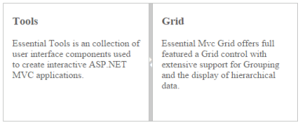

## Keyboard Navigation

With the keyboard navigation enabled in the Splitter control, it is possible to control the actions of the Splitter with the provided shortcut keys. Almost all the Splitter actions that are done by mouse can be controlled with shortcut keys.

The various keyboard shortcuts available within the Splitter control are discussed in the following table.

_Table_ _1__: Keyboard Shortcuts_

<table>
<tr>
<th>
Shortcut Key</th><td>
Description</th></tr>
<tr>
<td>
Left</td><td>
Moves the Splitbar left. </td></tr>
<tr>
<td>
Right</td><td>
Moves the Splitbar right. </td></tr>
<tr>
<td>
Ctrl + Left</td><td>
Collapses the left pane.</td></tr>
<tr>
<td>
Ctrl + Right</td><td>
Collapses the right pane.</td></tr>
<tr>
<td>
Up</td><td>
Moves the Splitbar up.</td></tr>
<tr>
<td>
Down</td><td>
Moves the Splitbar down.</td></tr>
<tr>
<td>
Ctrl + Up</td><td>
Collapses the top pane.</td></tr>
<tr>
<td>
Ctrl + Down</td><td>
Collapses the bottom pane.</td></tr>
<tr>
<td>
Enter</td><td>
Resize the pane to the current Splitbar position.</td></tr>
<tr>
<td>
Esc</td><td>
Focuses out from the Splitbar.</td></tr>
</table>
Configuring Keyboard Navigation

The following steps explain to enable keyboard interaction for Splitter widget.

1. In the View page add Splitter helper to render the control. 


@{Html.EJ().Splitter("Splitter").Height("200").Width("500").PaneProperties(
    p =>    {        p.Add().ContentTemplate(
	@
 
	

	<h3 class="h3">Tools </h3>
	Essential Tools is an collection of user interface components used to create interactive
	ASP.NET MVC applications.
	
 
	
);
	p.Add().ContentTemplate(
	@

	

	<h3 class="h3">Grid </h3>
	Essential Mvc Grid offers full featured a Grid control with extensive support for
	Grouping and the display of hierarchical data.
	

	
);
    }).Render();}



    



1. Run the sample and press Alt + J to focus the Splitter widget. We can fully utilize the functionalionality of the splitter control by using keyboard shortcuts.

