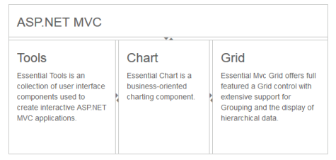

## Nested Splitter Support

The Splitter provides nested pane support that allows you to add a pane between two pane elements.

Configure Nested Splitter

The following steps explain the implementation of the “nestedsplitter”option.

1. In the View page, add the Splitter helper and configure the outer and inner splitters. As you can see we have specified a heper function to render the inner splitter. A helper is a reusable snippet of Razor sytnax exposed as a method, and is intended for rendering HTML to the browse. To use helper within another helper we have specified as a separate function as shown below.

[CSHTML]

@{Html.EJ().Splitter("outterSplitter").Height("300").Width("600").Orientation(Orientation.Vertical).PaneProperties(

    p =>

    {

        p.Add().ContentTemplate(

            @&lt;div&gt;

                &lt;div class="content" style="padding: 0px 15px;"&gt;

                    &lt;h3 class="h3"&gt;

                        ASP.NET MVC

                    &lt;/h3&gt;

                &lt;/div&gt;

            &lt;/div&gt;).PaneSize("60");

        p.Add().ContentTemplate(

            @&lt;div style="height: 100%; width: 100%"&gt;

                @innerSplitter()

            &lt;/div&gt;);

    }).Render();}

@helper innerSplitter()

{

    @Html.EJ().Splitter("innerSplitter").Width("600").PaneProperties(p1 =>

                {

                    p1.Add().ContentTemplate(@&lt;div&gt;

                        &lt;div class="content"&gt;

                            &lt;h3 class="h3"&gt;

                                Tools

                            &lt;/h3&gt;

                           Essential Tools is an collection of user interface components used to create interactive

                            ASP.NET MVC applications.

                        &lt;/div&gt;

                    &lt;/div&gt;).PaneSize("200");

                    p1.Add().ContentTemplate(@&lt;div&gt;

            &lt;div class="content"&gt;

                &lt;h3 class="h3"&gt;

                    Chart

                &lt;/h3&gt;

                Essential Chart is a business-oriented charting component.

            &lt;/div&gt;

        &lt;/div&gt;).PaneSize("200");

                    p1.Add().ContentTemplate(@&lt;div&gt;

            &lt;div class="content"&gt;

                &lt;h3 class="h3"&gt;

                    Grid

                &lt;/h3&gt;

                Essential Mvc Grid offers full featured a Grid control with extensive support for

                Grouping and the display of hierarchical data.

            &lt;/div&gt;

        &lt;/div&gt;).PaneSize("200");

                })

}

[CSS]

    &lt;style type="text/css" &gt;

        #outterSplitter {

            margin: 0 auto;

        }

        .h3 {

            font-size: 14px;

        }

        #innerSplitter {

            border: 0 none;

        }

        .content {

            padding: 15px;

        }

    &lt;/style&gt;

The output for nested Splitter.

{  | markdownify }
{:.image }

