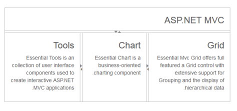

## RTL Support

The Splitter provides you with RTL (Right-To-Left) support. The alignment of Splitter can be changed from Left-To-Right to Right-To-Left.

Enable RTL

The following steps explain enabling the right-to-left property for Splitter widget.

In the View page add the Splitter helper to enable the RTL functionality. 

[CSHTML]

@{Html.EJ().Splitter("outterSplitter").Height("300").Width("600").Orientation(Orientation.Vertical).EnableRTL(true)

      .PaneProperties(

    p =>

    {

        p.Add().ContentTemplate(

            @

                

                    <h3 class="h3">

                        ASP.NET MVC

                    </h3>

                

            
).PaneSize("60");

        p.Add().ContentTemplate(

            @

                @innerSplitter()

            
);

    }).Render();}

@helper innerSplitter()

{

    @Html.EJ().Splitter("innerSplitter").Width("600").PaneProperties(p1 =>

                {

                    p1.Add().ContentTemplate(@

                        

                            <h3 class="h3">

                                Tools

                            </h3>

                            Essential Tools is an collection of user interface components used to create interactive

                            ASP.NET MVC applications.

                        

                    
).PaneSize("200");

                    p1.Add().ContentTemplate(@

            

                <h3 class="h3">

                    Chart

                </h3>

                Essential Chart is a business-oriented charting component.

            

        
).PaneSize("200");

                    p1.Add().ContentTemplate(@

            

                <h3 class="h3">

                    Grid

                </h3>

                Essential Mvc Grid offers full featured a Grid control with extensive support for

                Grouping and the display of hierarchical data.

            

        
).PaneSize("200");

                })

}

[CSS]

The output for Splitter when EnableRTL is “True”.

{{ '' | markdownify }}
{:.image }

__

