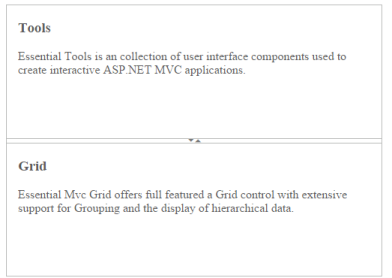
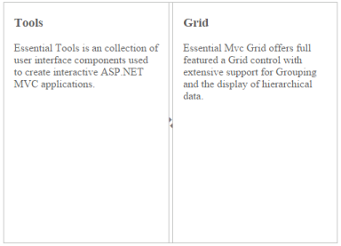

## Splitter Orientation

The Splitter supports both vertical and horizontal orientation of the pane. You can declare the orientation by using enum, ej.Orientation.Vertical or ej.Orientation.Horizontal, that have the corresponding value of vertical and horizontal as a string.

Configure Splitter Orientation

 The following steps explain the implementation of Splitter orientation option.

1. In the View page, add the Splitter helper and configure the ‘Orientation’ property as shown below.

[CSHTML]

        @{Html.EJ().Splitter("Splitter").Height("360").Width("500").Orientation(Orientation.Vertical).PaneProperties(

    p =>

    {

        p.Add().ContentTemplate(

            @&lt;div&gt;

                 &lt;div style="padding: 0px 15px;"&gt;

                     <h3 class="h3">Tools &lt;/h3&gt;

                     Essential Tools is an collection of user interface components used to create interactive

                     ASP.NET MVC applications.

                 &lt;/div&gt;

            &lt;/div&gt;);

        p.Add().ContentTemplate(

            @&lt;div&gt;

                 &lt;div style="padding: 0px 15px;"&gt;

                     <h3 class="h3">Grid &lt;/h3&gt;

                     Essential Mvc Grid offers full featured a Grid control with extensive support for

                     Grouping and the display of hierarchical data.

                 &lt;/div&gt;

            &lt;/div&gt;);

    }).Render();}

The output for Splitter with ej.Orientation.Vertical.

{  | markdownify }
{:.image }

The output for Splitter with ej.Orientation.Horizontal.

{  | markdownify }
{:.image }

