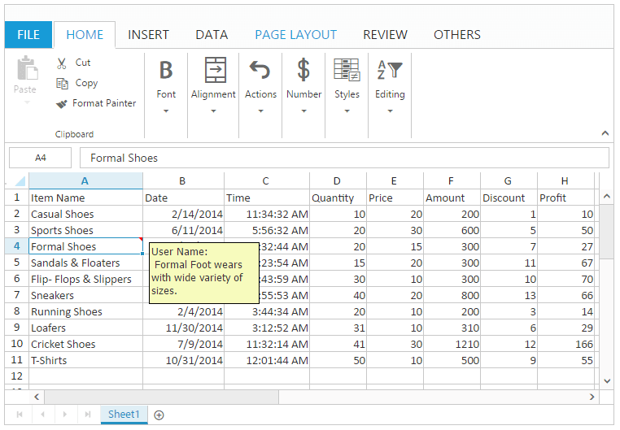
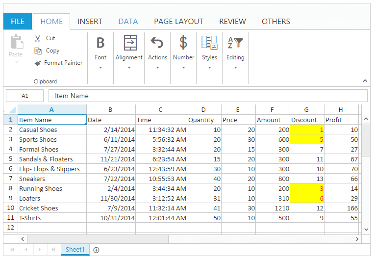
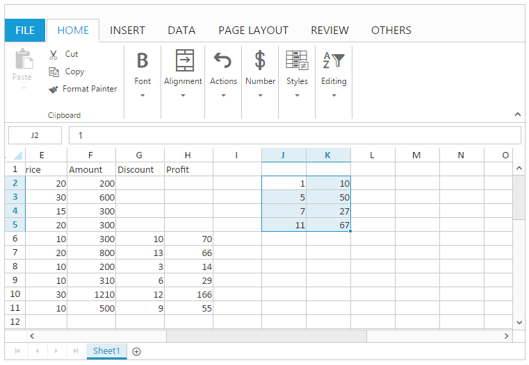
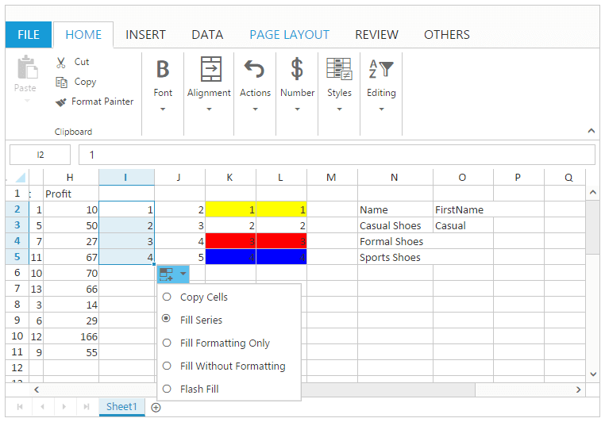
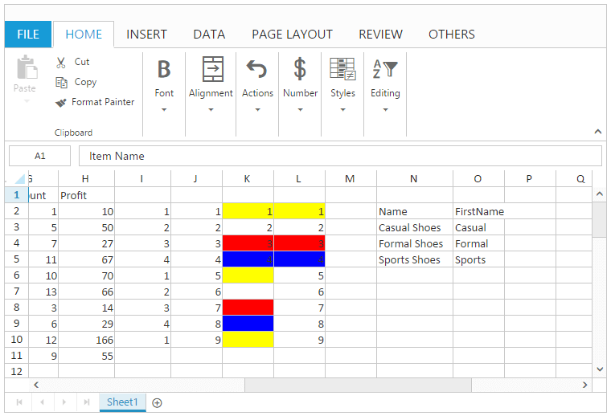
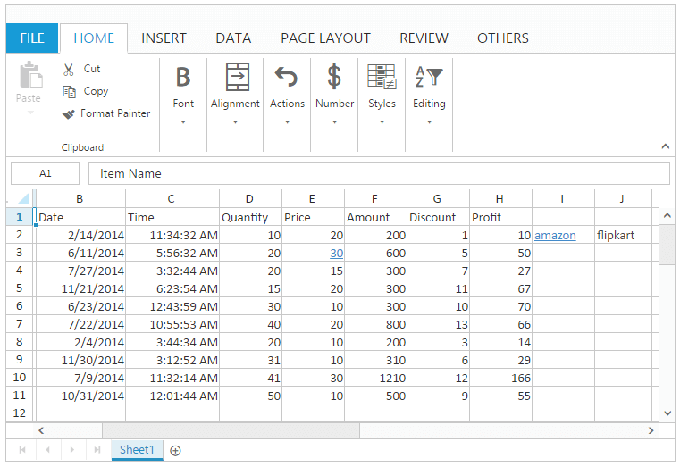
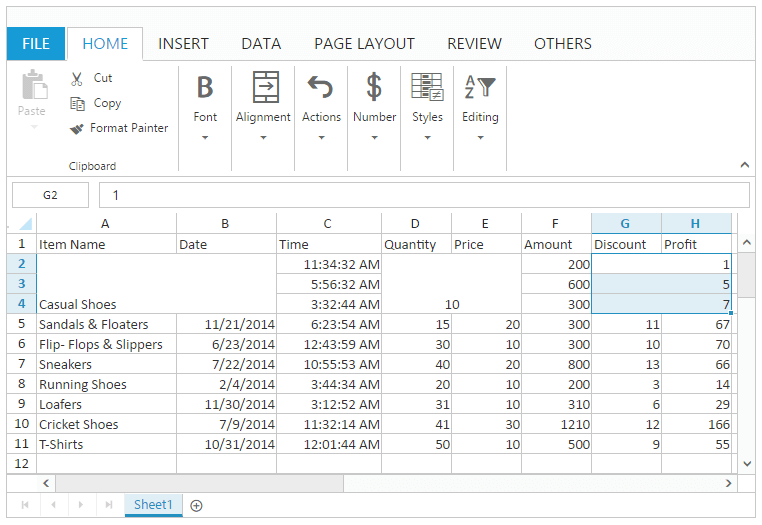
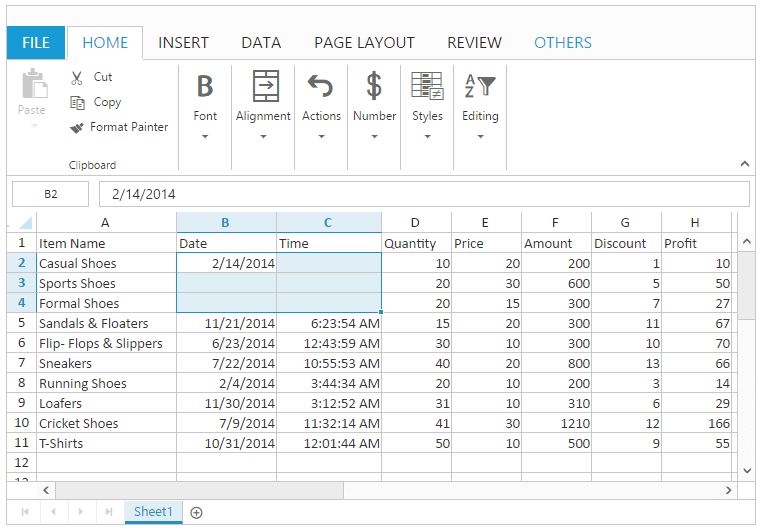

---
layout: post
title: Cell Range with Spreadsheet widget for Syncfusion Essential ASP.NET MVC
description: How to use the Spreadsheet Cell Range
platform: ejmvc
control: Spreadsheet
documentation: ug
--- 

# Cell Range

A Cell Range is a collection of cells in a sheet. It represents single cell or selection of cells. When cells have been selected, they are surrounded by border. 

You have following features in Cell Range,

* Comment
* Cell Navigation
* Data Validation
* Drag and Drop
* Drag Fill
* Hyperlink
* Merge Cell

## Comment

Comment is used to add notes to individual cell to give additional information for the data it contains. When a cell has a comment, a red indicator appears in the corner of the cell. When mouse hover on the cell, the comment will appear. You can use `AllowComments` property to enable/disable comments. 

### To insert a Comment

You can insert a comment by using one of the following ways,

* Using "New" button under Comments group of REVIEW Tab in ribbon.
* Using context menu to select "Insert Comment" option in "Comment".
* Using `setComment` method.

### To Remove a Comment

You can remove a comment by using one of the following ways,

* Using "Delete" button under Comments group of REVIEW Tab in ribbon.
* Using context menu to select "Delete Comment" option in "Comment".
* Using `deleteComment` method.

The following code example describes the above behavior.




@(Html.EJ().Spreadsheet<object>("Spreadsheet")
    .Sheets(sheet =>
    {
        sheet.RangeSettings(range =>
        {
            range.Datasource((IEnumerable<object>)ViewBag.Datasource).ShowHeader(true).Add();
        }).Add();
    })
    .ClientSideEvents(events => events.LoadComplete("loadComplete"))
)

    



namespace MVCSampleBrowser.Controllers
{
    public partial class SpreadsheetController : Controller
    {
        public ActionResult Default()
        {
            List<ItemDetail> lItems = new List<ItemDetail>();
            lItems.Add(new ItemDetail() { ItemName = "Casual Shoes", Date = new DateTime(2014, 02, 14), Time = new DateTime(2014, 02, 14, 11, 34, 32), Quantity = 10, Price = 20, Amount = 200, Discount = 1, Profit = 10 });
            lItems.Add(new ItemDetail() { ItemName = "Sports Shoes", Date = new DateTime(2014, 06, 11), Time = new DateTime(2014, 06, 11, 05, 56, 32), Quantity = 20, Price = 30, Amount = 600, Discount = 5, Profit = 50 });
            lItems.Add(new ItemDetail() { ItemName = "Formal Shoes", Date = new DateTime(2014, 07, 27), Time = new DateTime(2014, 07, 27, 03, 32, 44), Quantity = 20, Price = 15, Amount = 300, Discount = 7, Profit = 27 });
            lItems.Add(new ItemDetail() { ItemName = "Sandals & Floaters", Date = new DateTime(2014, 11, 21), Time = new DateTime(2014, 11, 21, 06, 23, 54), Quantity = 15, Price = 20, Amount = 300, Discount = 11, Profit = 67 });
            lItems.Add(new ItemDetail() { ItemName = "Flip- Flops & Slippers", Date = new DateTime(2014, 06, 23), Time = new DateTime(2014, 06, 23, 12, 43, 59), Quantity = 30, Price = 10, Amount = 300, Discount = 10, Profit = 70 });
            ViewBag.Datasource = lItems;
            return View();
        }
    }
}




The following output is displayed as a result of the above code example.

## Cell Navigation

Cell navigation is used to navigate through the cells using keyboard. You can use `AllowKeyboardNavigation` property to enable/disable cell navigation. You have the following support for cell navigation.

N> In the below table, first cell and last cell is based on the used range.

<table>
<colgroup><col width="180px" /></colgroup>
<tr><th>Keys </th><th>Description </th></tr>
<tr><td>Ctrl + Home </td><td>Go to first cell in the first row. </td></tr>
<tr><td>Ctrl + End </td><td>Go to last cell in the last row. </td></tr>
<tr><td>Up Arrow </td><td>Go to previous cell in the same column </td></tr>
<tr><td>Down Arrow </td><td>Go to next cell in the same column </td></tr>
<tr><td>Right Arrow </td><td>Go to next cell in the same row </td></tr>
<tr><td>Left Arrow </td><td>Go to previous cell in the same row </td></tr>
<tr><td>Page Down </td><td>Go to next block </td></tr>
<tr><td>Page Up </td><td>Go to previous block </td></tr>
<tr><td>Home </td><td>Go to first cell of the same row </td></tr>
<tr><td>End </td><td>Go to last cell of the same row </td></tr>
<tr><td>F2 </td><td>Start edit </td></tr>
<tr><td>Enter </td><td>Save the current cell changes and navigate to the next row. </td></tr>
<tr><td>Delete </td><td>Delete selected cells </td></tr>
<tr><td>Esc </td><td>Cancel edit mode and discard changes. </td></tr>
<tr><td>Tab </td><td>Go to next cell </td></tr>
<tr><td>Shift + Tab </td><td>Go to previous cell </td></tr>
<tr><td>Shift + Up Arrow </td><td>Go to previous row or previous row cell with selection </td></tr>
<tr><td>Shift+ Down Arrow </td><td>Go to next row or next row cell with selection </td></tr>
<tr><td>Shift + Right Arrow </td><td>Go to next cell within the same row with selection </td></tr>
<tr><td>Shift + Left Arrow </td><td>Go to previous cell within the same row with selection </td></tr>
<tr><td>Ctrl + Up Arrow </td><td>Go to next cell from the first empty cell in upwards. </td></tr>
<tr><td>Ctrl + Down Arrow </td><td>Go to previous cell from the first empty cell in downwards. </td></tr>
<tr><td>Ctrl + Left Arrow </td><td>Go to next cell from the first empty cell in leftwards. </td></tr>
<tr><td>Ctrl+ Right Arrow </td><td>Go to previous cell from the first empty cell in rightwards. </td></tr>
</table>

## Data Validation

Data Validation is used to restrict the user to enter the invalid data. You can use `AllowDataValidation` property to enable/disable data validation. 

N> The below validation script files are needed for validation.
N> * jquery.validate.min.js
N> * jquery.validate.unobtrusive.min.js

#### To apply validation.

You can apply data validation by using one of the following ways,

* Using "Data Validation" option in Data Validation button under Data Tools group of DATA Tab in ribbon, Data Validation dialog will be opened in that you can perform Validation.
* Using `applyDVRules` method.

The following code example describes the above behavior.




@(Html.EJ().Spreadsheet<object>("Spreadsheet")
    .Sheets(sheet =>
    {
        sheet.RangeSettings(range =>
        {
            range.Datasource((IEnumerable<object>)ViewBag.Datasource).ShowHeader(true).Add();
        }).Add();
    })
    .ClientSideEvents(events => events.LoadComplete("loadComplete"))
)

    



namespace MVCSampleBrowser.Controllers
{
    public partial class SpreadsheetController : Controller
    {
        public ActionResult Default()
        {
            List<ItemDetail> lItems = new List<ItemDetail>();
            lItems.Add(new ItemDetail() { ItemName = "Casual Shoes", Date = new DateTime(2014, 02, 14), Time = new DateTime(2014, 02, 14, 11, 34, 32), Quantity = 10, Price = 20, Amount = 200, Discount = 1, Profit = 10 });
            lItems.Add(new ItemDetail() { ItemName = "Sports Shoes", Date = new DateTime(2014, 06, 11), Time = new DateTime(2014, 06, 11, 05, 56, 32), Quantity = 20, Price = 30, Amount = 600, Discount = 5, Profit = 50 });
            lItems.Add(new ItemDetail() { ItemName = "Formal Shoes", Date = new DateTime(2014, 07, 27), Time = new DateTime(2014, 07, 27, 03, 32, 44), Quantity = 20, Price = 15, Amount = 300, Discount = 7, Profit = 27 });
            lItems.Add(new ItemDetail() { ItemName = "Sandals & Floaters", Date = new DateTime(2014, 11, 21), Time = new DateTime(2014, 11, 21, 06, 23, 54), Quantity = 15, Price = 20, Amount = 300, Discount = 11, Profit = 67 });
            lItems.Add(new ItemDetail() { ItemName = "Flip- Flops & Slippers", Date = new DateTime(2014, 06, 23), Time = new DateTime(2014, 06, 23, 12, 43, 59), Quantity = 30, Price = 10, Amount = 300, Discount = 10, Profit = 70 });
            ViewBag.Datasource = lItems;
            return View();
        }
    }
}




#### To Clear validation

You can clear data validation rule by one of the following ways,

* Using "Clear Validation" option in Data Validation button under Data Tools group of DATA Tab in ribbon.
* Using `clearDV` method.

The following code example describes the above behavior.



@(Html.EJ().Spreadsheet<object>("Spreadsheet")
    .Sheets(sheet =>
    {
        sheet.RangeSettings(range =>
        {
            range.Datasource((IEnumerable<object>)ViewBag.Datasource).Add();
            range.ShowHeader(true).Add();
        }).Add();
    })
    .ClientSideEvents(events => events.LoadComplete("loadComplete"))
)

    



namespace MVCSampleBrowser.Controllers
{
    public partial class SpreadsheetController : Controller
    {
        public ActionResult Default()
        {
            List<ItemDetail> lItems = new List<ItemDetail>();
            lItems.Add(new ItemDetail() { ItemName = "Casual Shoes", Date = new DateTime(2014, 02, 14), Time = new DateTime(2014, 02, 14, 11, 34, 32), Quantity = 10, Price = 20, Amount = 200, Discount = 1, Profit = 10 });
            lItems.Add(new ItemDetail() { ItemName = "Sports Shoes", Date = new DateTime(2014, 06, 11), Time = new DateTime(2014, 06, 11, 05, 56, 32), Quantity = 20, Price = 30, Amount = 600, Discount = 5, Profit = 50 });
            lItems.Add(new ItemDetail() { ItemName = "Formal Shoes", Date = new DateTime(2014, 07, 27), Time = new DateTime(2014, 07, 27, 03, 32, 44), Quantity = 20, Price = 15, Amount = 300, Discount = 7, Profit = 27 });
            lItems.Add(new ItemDetail() { ItemName = "Sandals & Floaters", Date = new DateTime(2014, 11, 21), Time = new DateTime(2014, 11, 21, 06, 23, 54), Quantity = 15, Price = 20, Amount = 300, Discount = 11, Profit = 67 });
            lItems.Add(new ItemDetail() { ItemName = "Flip- Flops & Slippers", Date = new DateTime(2014, 06, 23), Time = new DateTime(2014, 06, 23, 12, 43, 59), Quantity = 30, Price = 10, Amount = 300, Discount = 10, Profit = 70 });
            ViewBag.Datasource = lItems;
            return View();
        }
    }
}




#### To Format invalid data

You can highlight the invalid data by using following ways,

* Using "Format Invalid Data" option in Data Validation button under Data Tools group of DATA Tab in ribbon.
* Using `highlightInvalidData` method.

The following code example describes the above behavior.



@(Html.EJ().Spreadsheet<object>("Spreadsheet")
    .Sheets(sheet =>
    {
        sheet.RangeSettings(range =>
        {
            range.Datasource((IEnumerable<object>)ViewBag.Datasource).ShowHeader(true).Add();
        }).Add();
    })
    .ClientSideEvents(events => events.LoadComplete("loadComplete"))
)

    



namespace MVCSampleBrowser.Controllers
{
    public partial class SpreadsheetController : Controller
    {
        public ActionResult Default()
        {
            List<ItemDetail> lItems = new List<ItemDetail>();
            lItems.Add(new ItemDetail() { ItemName = "Casual Shoes", Date = new DateTime(2014, 02, 14), Time = new DateTime(2014, 02, 14, 11, 34, 32), Quantity = 10, Price = 20, Amount = 200, Discount = 1, Profit = 10 });
            lItems.Add(new ItemDetail() { ItemName = "Sports Shoes", Date = new DateTime(2014, 06, 11), Time = new DateTime(2014, 06, 11, 05, 56, 32), Quantity = 20, Price = 30, Amount = 600, Discount = 5, Profit = 50 });
            lItems.Add(new ItemDetail() { ItemName = "Formal Shoes", Date = new DateTime(2014, 07, 27), Time = new DateTime(2014, 07, 27, 03, 32, 44), Quantity = 20, Price = 15, Amount = 300, Discount = 7, Profit = 27 });
            lItems.Add(new ItemDetail() { ItemName = "Sandals & Floaters", Date = new DateTime(2014, 11, 21), Time = new DateTime(2014, 11, 21, 06, 23, 54), Quantity = 15, Price = 20, Amount = 300, Discount = 11, Profit = 67 });
            lItems.Add(new ItemDetail() { ItemName = "Flip- Flops & Slippers", Date = new DateTime(2014, 06, 23), Time = new DateTime(2014, 06, 23, 12, 43, 59), Quantity = 30, Price = 10, Amount = 300, Discount = 10, Profit = 70 });
            ViewBag.Datasource = lItems;
            return View();
        }
    }
}




The following output is displayed as a result of the above code example.

## Drag and Drop

Drag and drop is used to pick a selected cells and drop it into a new place on the worksheet. You can use `AllowDragAndDrop` property to enable/disable drag and drop. 

You can do this by one of the following ways,

* Using mouse drag and drop.
* Using `moveRangeTo` Method.

The following code example describes the above behavior.



@(Html.EJ().Spreadsheet<object>("Spreadsheet")
    .Sheets(sheet =>
    {
        sheet.RangeSettings(range =>
        {
            range.Datasource((IEnumerable<object>)ViewBag.Datasource).ShowHeader(true).Add();
        }).Add();
    })
    .ClientSideEvents(events => events.LoadComplete("loadComplete"))
)

    



namespace MVCSampleBrowser.Controllers
{
    public partial class SpreadsheetController : Controller
    {
        public ActionResult Default()
        {
            List<ItemDetail> lItems = new List<ItemDetail>();
            lItems.Add(new ItemDetail() { ItemName = "Casual Shoes", Date = new DateTime(2014, 02, 14), Time = new DateTime(2014, 02, 14, 11, 34, 32), Quantity = 10, Price = 20, Amount = 200, Discount = 1, Profit = 10 });
            lItems.Add(new ItemDetail() { ItemName = "Sports Shoes", Date = new DateTime(2014, 06, 11), Time = new DateTime(2014, 06, 11, 05, 56, 32), Quantity = 20, Price = 30, Amount = 600, Discount = 5, Profit = 50 });
            lItems.Add(new ItemDetail() { ItemName = "Formal Shoes", Date = new DateTime(2014, 07, 27), Time = new DateTime(2014, 07, 27, 03, 32, 44), Quantity = 20, Price = 15, Amount = 300, Discount = 7, Profit = 27 });
            lItems.Add(new ItemDetail() { ItemName = "Sandals & Floaters", Date = new DateTime(2014, 11, 21), Time = new DateTime(2014, 11, 21, 06, 23, 54), Quantity = 15, Price = 20, Amount = 300, Discount = 11, Profit = 67 });
            lItems.Add(new ItemDetail() { ItemName = "Flip- Flops & Slippers", Date = new DateTime(2014, 06, 23), Time = new DateTime(2014, 06, 23, 12, 43, 59), Quantity = 30, Price = 10, Amount = 300, Discount = 10, Profit = 70 });
            ViewBag.Datasource = lItems;
            return View();
        }
    }
}




The following output is displayed as a result of the above code example.

## Drag Fill

Drag Fill is used to fill the cells with data based on adjacent cells. It also follows a pattern from adjacent cells if available. There is no need to enter the repeated data manually. You can use `AllowAutoFill` property to enable/disable the drag fill support. You can also use `ShowFillOptions` property to enable/disable the fill option and `FillType` property to change the default auto fill option which is available in `AutoFillSettings`. 

You can do this by one of the following ways.

* Using "Drag Fill" menu which is open, while drag and drop the fill handle element.
* Using `autoFill` method.

In Drag Fill we have following options, 

* Copy Cells
* Fill Series
* Fill Formatting Only
* Fill Without Formatting
* Flash Fill

N> The default auto fill option is "fillSeries" which can be referred from `FillType` property.

#### Copy Cells

To copy the selected cell content to the adjacent cells. You can do this by one of the following ways.

* Using fill handle to select the adjacent cell range and "Copy Cells" option in "Drag Fill" menu to fill the adjacent cells.
* Using "copyCells" as fill type in `autoFill` method to fill the adjacent cells.

#### Fill Series

To fill the series of numbers, characters, or dates based on selected cell content to the adjacent cells with their formats.

You can do this by one of the following ways,

* Using fill handle to select the adjacent cell range and "Fill Series" option in "Drag Fill" menu to fill the adjacent cells.
* Using "fillSeries" as fill type in `autoFill` method to fill the adjacent cells.

#### Fill Formatting Only

To fill the cell style and number formatting based on the selected cell content to the adjacent cells without their content.

You can do this by one of the following ways,

* Using fill handle to select the adjacent cell range and "Fill Formatting Only" option in "Drag Fill" menu to fill the adjacent cells.
* Using "fillFormattingOnly" as fill type in `autoFill` method to fill the adjacent cells.

#### Fill Without Formatting

To fill series of numbers, characters, or dates based on the selected cells to the adjacent cells without their formats.

You can do this by one of the following ways,

* Using fill handle to select the adjacent cell range and "Fill Without Formatting" option in "Drag Fill" menu to fill the adjacent cells.
* Using "fillWithoutFormatting" as fill type in `autoFill` method to fill the adjacent cells.

#### Flash Fill 

You can do this by one of the following ways,

* Using fill handle to select the adjacent cell range and "Flash Fill" option in "Drag Fill" menu to fill the adjacent cells.
* Using "flashFill" as fill type in `autoFill` method to fill the adjacent cells.

The following output is displayed as a result of the "Drag Fill" menu in User Interface.

The following code example describes the above behavior.




@(Html.EJ().Spreadsheet<object>("Spreadsheet")
    .Sheets(sheet =>
    {
        sheet.RangeSettings(range =>
        {
            range.Datasource((IEnumerable<object>)ViewBag.Datasource).ShowHeader(true).StartCell("B1").Add();
        }).Add();
    })
    .ClientSideEvents(events => events.LoadComplete("loadComplete"))
)

    



namespace MVCSampleBrowser.Controllers
{
    public partial class SpreadsheetController : Controller
    {
        public ActionResult Default()
        {
            List<ItemDetail> lItems = new List<ItemDetail>();
            lItems.Add(new ItemDetail() { ItemName = "Casual Shoes", Date = new DateTime(2014, 02, 14), Time = new DateTime(2014, 02, 14, 11, 34, 32), Quantity = 10, Price = 20, Amount = 200, Discount = 1, Profit = 10 });
            lItems.Add(new ItemDetail() { ItemName = "Sports Shoes", Date = new DateTime(2014, 06, 11), Time = new DateTime(2014, 06, 11, 05, 56, 32), Quantity = 20, Price = 30, Amount = 600, Discount = 5, Profit = 50 });
            lItems.Add(new ItemDetail() { ItemName = "Formal Shoes", Date = new DateTime(2014, 07, 27), Time = new DateTime(2014, 07, 27, 03, 32, 44), Quantity = 20, Price = 15, Amount = 300, Discount = 7, Profit = 27 });
            lItems.Add(new ItemDetail() { ItemName = "Sandals & Floaters", Date = new DateTime(2014, 11, 21), Time = new DateTime(2014, 11, 21, 06, 23, 54), Quantity = 15, Price = 20, Amount = 300, Discount = 11, Profit = 67 });
            lItems.Add(new ItemDetail() { ItemName = "Flip- Flops & Slippers", Date = new DateTime(2014, 06, 23), Time = new DateTime(2014, 06, 23, 12, 43, 59), Quantity = 30, Price = 10, Amount = 300, Discount = 10, Profit = 70 });
            ViewBag.Datasource = lItems;
            return View();
        }
    }
}




The following output is displayed as a result of the above code example.

## Hyperlink

Hyperlink is used to navigate to web links or cell reference to other sheets or within the sheet in Spreadsheet. You can use `AllowHyperlink` property to enable/disable Hyperlink.

### To Insert a Hyperlink

You can insert a hyperlink by one of the following ways,

* Using "Hyperlink" button under Links group of INSERT Tab in ribbon.
* Using context menu to select "Insert Hyperlink" option in "Hyperlink".
* Using `setHyperlink` method.

### To Remove a Hyperlink

You can remove a hyperlink by one of the following ways,

* Using context menu to select "Remove Hyperlink" option in Hyperlink.
* Using `removeHyperlink` method.

The following code example describes the above behavior.




@(Html.EJ().Spreadsheet<object>("Spreadsheet")
    .Sheets(sheet =>
    {
        sheet.RangeSettings(range =>
        {
            range.Datasource((IEnumerable<object>)ViewBag.Datasource).ShowHeader(true).Add();
        }).Add();
    })
    .ClientSideEvents(events => events.LoadComplete("loadComplete"))
)

    



namespace MVCSampleBrowser.Controllers
{
    public partial class SpreadsheetController : Controller
    {
        public ActionResult Default()
        {
            List<ItemDetail> lItems = new List<ItemDetail>();
            lItems.Add(new ItemDetail() { ItemName = "Casual Shoes", Date = new DateTime(2014, 02, 14), Time = new DateTime(2014, 02, 14, 11, 34, 32), Quantity = 10, Price = 20, Amount = 200, Discount = 1, Profit = 10 });
            lItems.Add(new ItemDetail() { ItemName = "Sports Shoes", Date = new DateTime(2014, 06, 11), Time = new DateTime(2014, 06, 11, 05, 56, 32), Quantity = 20, Price = 30, Amount = 600, Discount = 5, Profit = 50 });
            lItems.Add(new ItemDetail() { ItemName = "Formal Shoes", Date = new DateTime(2014, 07, 27), Time = new DateTime(2014, 07, 27, 03, 32, 44), Quantity = 20, Price = 15, Amount = 300, Discount = 7, Profit = 27 });
            lItems.Add(new ItemDetail() { ItemName = "Sandals & Floaters", Date = new DateTime(2014, 11, 21), Time = new DateTime(2014, 11, 21, 06, 23, 54), Quantity = 15, Price = 20, Amount = 300, Discount = 11, Profit = 67 });
            lItems.Add(new ItemDetail() { ItemName = "Flip- Flops & Slippers", Date = new DateTime(2014, 06, 23), Time = new DateTime(2014, 06, 23, 12, 43, 59), Quantity = 30, Price = 10, Amount = 300, Discount = 10, Profit = 70 });
            ViewBag.Datasource = lItems;
            return View();
        }
    }
}




The following output is displayed as a result of the above code example.

## Merge Cell

Merge cell is a single cell created by combining two or more individual cells together. You can use `AllowMerging` property to enable/disable merge cells. The cell reference for a merged cell is the cell in the upper left corner of the original selected range or group of cells. 

### Merge Cells

You can combine two or more cells located in the same row or column into a single cell. When cells with multiple values are merged, upper-left most cell's data will be the data of merged cell. 

You can do this by one of the following ways,

* Using "Merge Cells" option in Merge & Center button under Alignment group of HOME Tab in ribbon.
* Using `mergeCells` method.

### Merge & Center

You can combine two or more cells located in the same row or column into a single cell with center text align. When cells with multiple values are merged, upper-left most cell's data will be the data of the merged cell. You can do this by one of the following ways,

* Using Merge & Center button under Alignment group of HOME Tab in ribbon.
* Using "Merge & Center" option in Merge & Center button under Alignment group of HOME Tab in ribbon.
* Using `mergeCells` method.
* Using `mergeCenter` property to enable/disable the center alignment.

### Merge Across

You can combine two or more cells located in the same row into a single cell. When cells with multiple values are merged, left most cell's data will be the data of the merged cell.

You can do this by one of the following ways,

* Using "Merge Across" option in Merge & Center button under Alignment group of HOME Tab in ribbon.
* Using `mergeAcrossCells` method.

The following code example describes the behavior of Merge Cells, Merge & Center and Merge Across.




@(Html.EJ().Spreadsheet<object>("Spreadsheet")
    .Sheets(sheet =>
    {
        sheet.RangeSettings(range =>
        {
            range.Datasource((IEnumerable<object>)ViewBag.Datasource).ShowHeader(true).Add();
        }).Add();
    })
    .ClientSideEvents(events => events.LoadComplete("loadComplete"))
)

    



namespace MVCSampleBrowser.Controllers
{
    public partial class SpreadsheetController : Controller
    {
        public ActionResult Default()
        {
            List<ItemDetail> lItems = new List<ItemDetail>();
            lItems.Add(new ItemDetail() { ItemName = "Casual Shoes", Date = new DateTime(2014, 02, 14), Time = new DateTime(2014, 02, 14, 11, 34, 32), Quantity = 10, Price = 20, Amount = 200, Discount = 1, Profit = 10 });
            lItems.Add(new ItemDetail() { ItemName = "Sports Shoes", Date = new DateTime(2014, 06, 11), Time = new DateTime(2014, 06, 11, 05, 56, 32), Quantity = 20, Price = 30, Amount = 600, Discount = 5, Profit = 50 });
            lItems.Add(new ItemDetail() { ItemName = "Formal Shoes", Date = new DateTime(2014, 07, 27), Time = new DateTime(2014, 07, 27, 03, 32, 44), Quantity = 20, Price = 15, Amount = 300, Discount = 7, Profit = 27 });
            lItems.Add(new ItemDetail() { ItemName = "Sandals & Floaters", Date = new DateTime(2014, 11, 21), Time = new DateTime(2014, 11, 21, 06, 23, 54), Quantity = 15, Price = 20, Amount = 300, Discount = 11, Profit = 67 });
            lItems.Add(new ItemDetail() { ItemName = "Flip- Flops & Slippers", Date = new DateTime(2014, 06, 23), Time = new DateTime(2014, 06, 23, 12, 43, 59), Quantity = 30, Price = 10, Amount = 300, Discount = 10, Profit = 70 });
            ViewBag.Datasource = lItems;
            return View();
        }
    }
}




The following output is displayed as a result of the above code example.

### Unmerge Cells

You can split the merged cell into multiple cells. You can do this by one of the following ways,

* Using "Unmerge cells" option in Merge & Center button under Alignment group of HOME Tab in ribbon.
* Using `unMergeCells` method.

The following code example describes the above behavior.




@(Html.EJ().Spreadsheet<object>("Spreadsheet")
    .Sheets(sheet =>
    {
        sheet.RangeSettings(range =>
        {
            range.Datasource((IEnumerable<object>)ViewBag.Datasource).ShowHeader(true).Add();
        }).Add();
    })
    .ClientSideEvents(events => events.LoadComplete("loadComplete"))
)

    



namespace MVCSampleBrowser.Controllers
{
    public partial class SpreadsheetController : Controller
    {
        public ActionResult Default()
        {
            List<ItemDetail> lItems = new List<ItemDetail>();
            lItems.Add(new ItemDetail() { ItemName = "Casual Shoes", Date = new DateTime(2014, 02, 14), Time = new DateTime(2014, 02, 14, 11, 34, 32), Quantity = 10, Price = 20, Amount = 200, Discount = 1, Profit = 10 });
            lItems.Add(new ItemDetail() { ItemName = "Sports Shoes", Date = new DateTime(2014, 06, 11), Time = new DateTime(2014, 06, 11, 05, 56, 32), Quantity = 20, Price = 30, Amount = 600, Discount = 5, Profit = 50 });
            lItems.Add(new ItemDetail() { ItemName = "Formal Shoes", Date = new DateTime(2014, 07, 27), Time = new DateTime(2014, 07, 27, 03, 32, 44), Quantity = 20, Price = 15, Amount = 300, Discount = 7, Profit = 27 });
            lItems.Add(new ItemDetail() { ItemName = "Sandals & Floaters", Date = new DateTime(2014, 11, 21), Time = new DateTime(2014, 11, 21, 06, 23, 54), Quantity = 15, Price = 20, Amount = 300, Discount = 11, Profit = 67 });
            lItems.Add(new ItemDetail() { ItemName = "Flip- Flops & Slippers", Date = new DateTime(2014, 06, 23), Time = new DateTime(2014, 06, 23, 12, 43, 59), Quantity = 30, Price = 10, Amount = 300, Discount = 10, Profit = 70 });
            ViewBag.Datasource = lItems;
            return View();
        }
    }
}




The following output is displayed as a result of the above code example.
