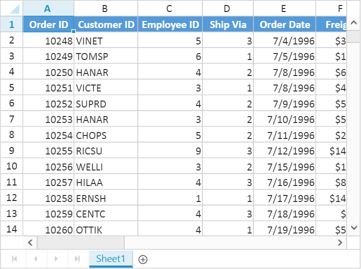

---
layout: post
title: Open and Save in ASP.NET MVC Spreadsheet widget | Syncfusion
description: You can learn here about Open and Save support in Syncfusion ASP.NET MVC Spreadsheet control and more details.
platform: ejmvc
control: Spreadsheet
documentation: ug
--- 

# Open and Save with ASP.NET MVC Spreadsheet
The native data format for Spreadsheet is JSON. You can load and store JSON data with Spreadsheet. In Spreadsheet we have [`saveAsJSON`](http://help.syncfusion.com/api/js/ejspreadsheet#methods:saveasjson "saveAsJSON") and [`loadFromJSON`](https://help.syncfusion.com/api/js/ejspreadsheet#methods:loadfromjson "loadFromJSON") method which is used to save Spreadsheet as JSON and same JSON used to render Spreadsheet.



function saveAsJSON() {
    var excelObj = $("#Spreadsheet").data("ejSpreadsheet");
    window.excelData = excelObj.saveAsJSON();
}

function loadFromJSON() {
    var excelObj = $("#Spreadsheet").data("ejSpreadsheet");
    excelObj.loadFromJSON(window.excelData);
}   
    


When you open excel file, it need to be read and converted to client side Spreadsheet model. The converted client side Spreadsheet model is sent as JSON which is used to render Spreadsheet. Similarly, when you save the Spreadsheet, the client Spreadsheet model is sent to the server as JSON for processing and saved. `Server configuration` is used for this process. 

## Open 
The Spreadsheet can open excel documents as like excel application with its data, style, format. To enable open option in Spreadsheet set `AllowImport` option to `true`. Since Spreadsheet uses a server side helper to open document, set `ImportMapper` in `ImportSettings` to map server action.




@(Html.EJ().Spreadsheet<object>("Spreadsheet")
    .AllowImport(true)
    .ImportSettings(import =>
    {
        import.ImportMapper("Import");
    })
)
    



namespace MVCSampleBrowser.Controllers
{
    public partial class SpreadsheetController : Controller
    {
        public ActionResult Default()
        {
            return View();
        }

        [AcceptVerbs(HttpVerbs.Post)]
        public ActionResult Import(ImportRequest importRequest)
        {
            return importRequest.SpreadsheetActions();
        }
    }
}
    



Following file types can be opened in Spreadsheet

* XLS
* XLSX
* CSV

[`Click`](http://mvc.syncfusion.com/demos/web/spreadsheet/importexport "Click") here to view online demo sample. You can open excel documents in following ways

1. Initial settings
2. Methods
3. User Interface

### Initial settings
The Spreadsheet can load excel documents initially. The document can be specified either from client side or in server side. To load excel documents initially from client side, set `ImportUrl` in `ImportSettings`. The code snippets for document initial load on client side are as follows,




@(Html.EJ().Spreadsheet<object>("Spreadsheet")
    .ImportSettings(import =>
    {
        import.ImportMapper("Import").ImportUrl("http://mvc.syncfusion.com/Spreadsheet/LargeData.xlsx");
    })
)
    



namespace MVCSampleBrowser.Controllers
{
    public partial class SpreadsheetController : Controller
    {
        public ActionResult Default()
        {
            return View();
        }

        [AcceptVerbs(HttpVerbs.Post)]
        public ActionResult Import(ImportRequest importRequest)
        {
            return importRequest.SpreadsheetActions();
        }
    }
}
    



To load excel documents initially from server side, set `ImportOnLoad`as `true` and assign document stream or URL in the server. The code snippets for document initial load from server side are as follows,



@(Html.EJ().Spreadsheet<object>("Spreadsheet")
    .ImportSettings(import =>
    {
        import.ImportOnLoad(true).ImportMapper("Import");
    })
)




namespace MVCSampleBrowser.Controllers
{
    public partial class SpreadsheetController : Controller
    {
        public ActionResult Default()
        {
            return View();
        }

        [AcceptVerbs(HttpVerbs.Post)]
        public ActionResult Import(ImportRequest importRequest)
        {
            importRequest.Url = "http://mvc.syncfusion.com/Spreadsheet/LargeData.xlsx";
            return importRequest.SpreadsheetActions();
        }
    }
}
    



### Methods
To open an excel document, [`import`](http://help.syncfusion.com/api/js/ejspreadsheet#methods:import "import") method should be called with import options as a parameter. The Spreadsheet can open excel document as a stream or file URL.
 
#### Stream
Spreadsheet can open excel document as a stream and the document stream was either from the client side or it can be specified in server side. The code snippets to open excel document as a stream from client side are as follows,



function fileOpen(args) {
    var excelObj = $("#Spreadsheet").data("ejSpreadsheet"),
    stream = args.files[0]; // file stream from ejUploadbox
    excelObj["import"]({ file: stream });
}
    


The Code snippets to specify excel document as stream in server side are as follows,



namespace MVCSampleBrowser.Controllers
{
    public partial class SpreadsheetController : Controller
    {
        public ActionResult Default()
        {
            var DataSource = new OrderItemsDataContext().GetAllItemDetails.ToList();
            ViewBag.Datasource = DataSource;
            return View();
        }
 
        [AcceptVerbs(HttpVerbs.Post)]
        public ActionResult Import(ImportRequest importRequest)
        {
            importRequest.FileStream = getFileStream(); // assign file stream
            return importRequest.SpreadsheetActions();
        }
    }
}



#### File URL
Spreadsheet can open excel document from specified URL. The URL can be specified either from client side or in server side. The code snippets to open excel document as URL from client side are as follows,



function fileOpen() {
    var excelObj = $("#Spreadsheet").data("ejSpreadsheet");
    excelObj["import"]({Url: "http://mvc.syncfusion.com/Spreadsheet/LargeData.xlsx"});
}
    


The Code snippets to specify excel document as URL in server side are as follows,



namespace MVCSampleBrowser.Controllers
{
    public partial class SpreadsheetController : Controller
    {
        public ActionResult Default()
        {
            return View();
        }

        [AcceptVerbs(HttpVerbs.Post)]
        public ActionResult Import(ImportRequest importRequest)
        {
            importRequest.Url = "http://mvc.syncfusion.com/Spreadsheet/LargeData.xlsx";
            return importRequest.SpreadsheetActions();
        }
    }
}
    


### User Interface
You can dynamically open excel document by clicking the file menu in ribbon and choose Open to upload excel file. 

## Save
The Spreadsheet can save its data, style, format into an excel file. To enable save option in Spreadsheet set `AllowExporting` option in `ExportSettings` as `true`. Since Spreadsheet uses server side helper to save documents set `ExcelUrl` in `ExportSettings` option.




@(Html.EJ().Spreadsheet<object>("Spreadsheet")
    .ExportSettings(export =>
    {
        export.AllowExporting(true).ExcelUrl("ExportToExcel").CsvUrl("ExportToCSV").PdfUrl("ExportToPDF");
    })
)
    



namespace MVCSampleBrowser.Controllers
{
    public partial class SpreadsheetController : Controller
    {
        public ActionResult Default()
        {
            return View();
        }
        
        [AcceptVerbs(HttpVerbs.Post)]
        public void ExportToExcel(string sheetModel, string sheetData, string password)
        {
            if (String.IsNullOrEmpty(password))
                Spreadsheet.Save(sheetModel, sheetData, "sample", ExportFormat.XLSX, ExcelVersion.Excel2013);
            else
                Spreadsheet.Save(sheetModel, sheetData, "sample", ExportFormat.XLSX, ExcelVersion.Excel2013, password);
        }

        [AcceptVerbs(HttpVerbs.Post)]
        public void ExportToCsv(string sheetModel, string sheetData)
        {
            Spreadsheet.Save(sheetModel, sheetData, "sample", ExportFormat.CSV);
        }

        [AcceptVerbs(HttpVerbs.Post)]
        public void ExportToPdf(string sheetModel, string sheetData)
        {
            Spreadsheet.Save(sheetModel, sheetData, "sample", ExportFormat.PDF);
        }
    }
}
    



N> To export as Stream skip file name parameter in Save method. For more details refer below code snippets,
N> Stream stream = Spreadsheet.Save(sheetModel, sheetData, ExportFormat.XLSX, ExcelVersion.Excel2013);

You can save Spreadsheet contents with following file types,

* XLS
* XLSX
* CSV
* PDF

[`Click`](http://mvc.syncfusion.com/demos/web/spreadsheet/importexport "Click") here to view online demo sample. You can save excel documents in following ways

1. Methods
2. User Interface

### Methods
To save Spreadsheet document as excel file, [`export`](http://help.syncfusion.com/api/js/ejspreadsheet#methods:xlexport-export "export") method should be called with file type as parameter. The code snippets to save Spreadsheet document are as follows,



function saveAsFile() {
    var excelObj = $("#spreadsheet").data("ejSpreadsheet");
    excelObj.XLExport["export"](ej.Spreadsheet.exportType.Excel);
}
    


### User Interface
You can dynamically save Spreadsheet by clicking file menu in ribbon and choose `SaveAs` option.

## Server dependencies
Import and Export Helper functions are available in the assembly `Syncfusion.EJ.Export`, which is available in Essential Studio and Essential JavaScript builds. The full list of assemblies needed for Spreadsheet import and export are as follows.

1. Syncfusion.EJ
2. Syncfusion.EJ.Export
3. Syncfusion.Linq.Base
4. Syncfusion.Compression.Base
5. Syncfusion.DocIO.Base
6. Syncfusion.XlsIO.Base
7. Syncfusion.PDF.Base
    
N> 1.  The above mentioned assemblies will be available in below location after Essential Studio build installation.
N> 2.  C:\Program Files (x86)\Syncfusion\Essential Studio\x.x.x.x\precompiledassemblies\x.x.x.x\y.y.
N> 3.  x.x.x.x defines build version of Essential Studio and y.y defines .NET Framework version.
