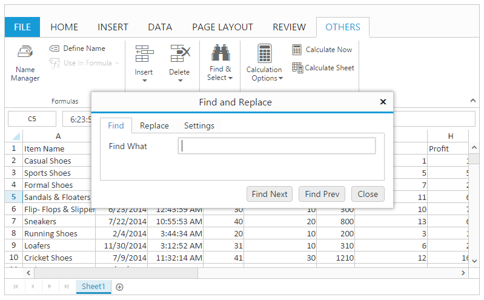
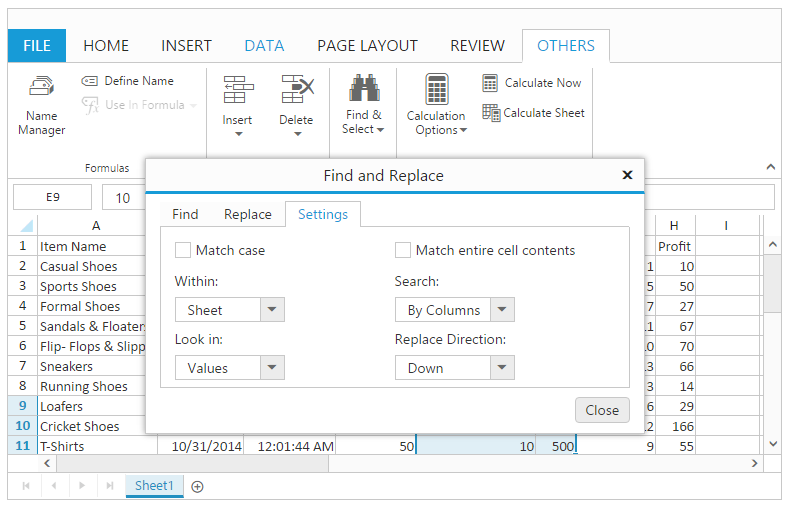
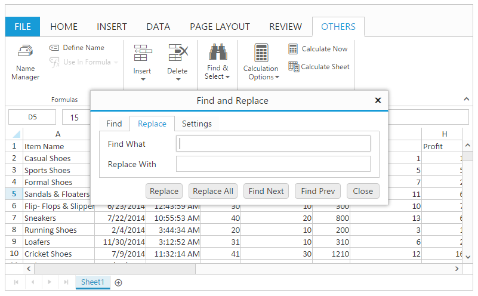
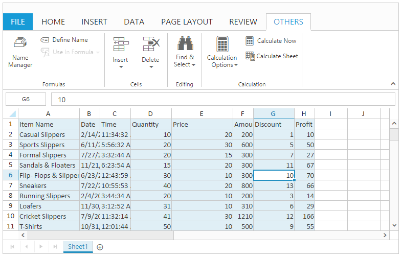

---
layout: post
title: Searching with Spreadsheet widget for Syncfusion Essential ASP.NET MVC
description: How to enable Searching and its functionalities
platform: ejmvc
control: Spreadsheet
documentation: ug
--- 

# Searching

This feature is used to search the contents in the Spreadsheet. You can use `AllowSearching` property to enable or disable this feature.

You have following options in Searching.

* Find
* Replace
* GoTo
* GoTo Special

## Find

This is used to search the contents of a cell. You can do this by one of the following ways,

* Using "Find" option in Find and Select button of OTHERS tab in ribbon to open the Find and Replace dialog.
* Using [`findNext`](https://help.syncfusion.com/api/js/ejspreadsheet#methods:xlsearch-findnext "findNext") and [`findPrevious`](https://help.syncfusion.com/api/js/ejspreadsheet#methods:xlsearch-findprevious "findPrevious") methods to search the given value in workbook.
* Using "Ctrl + F" key to open the Find and Replace dialog with Find tab enabled.

The following output is displayed as a result of Find and Replace dialog with Find tab enabled.

You can customize the following settings in find option.

* Match Case - Search content should have same casing compared with the cell content.
* Match Entire Cell Content - Search content should match with entire cell content.
* Look in - You can search the contents by values, formulas and comments.
* Within - You can search the content within the sheet or workbook.
* Search - You can search the contents by rows or columns.
* Replace Direction - You can replace the contents by up or down direction.

Find and Replace dialog with Settings tab
{:.caption}

## Replace

This is used to replace the contents of a cell. You can do this by one of the following ways.

* Using "Replace" option in Find and Select button of OTHERS tab in ribbon to open the Find and Replace dialog.
* Using [`replaceAllByBook`](https://help.syncfusion.com/api/js/ejspreadsheet#methods:xlsearch-replaceallbybook "replaceAllByBook") or [`replaceAllBySheet`](https://help.syncfusion.com/api/js/ejspreadsheet#methods:xlsearch-replaceallbysheet "replaceAllBySheet") method to replace the contents.
* Using "Ctrl + R" key to open the Find and Replace dialog with Replace tab enabled.

Find and Replace dialog with Replace tab
{:.caption}

The following code example describes the above behavior.




@(Html.EJ().Spreadsheet<object>("Spreadsheet")
    .Sheets(sheet =>
    {
        sheet.RangeSettings(range =>
        {
            range.Datasource((IEnumerable<object>)ViewBag.Datasource).Add();
        }).Add();
    })
    .ClientSideEvents(events => events.LoadComplete("loadComplete"))
)

    



namespace MVCSampleBrowser.Controllers
{
    public partial class SpreadsheetController : Controller
    {
        public ActionResult Default()
        {
            List<ItemDetail> lItems = new List<ItemDetail>();
            lItems.Add(new ItemDetail() { ItemName = "Casual Shoes", Date = new DateTime(2014, 02, 14), Time = new DateTime(2014, 02, 14, 11, 34, 32), Quantity = 10, Price = 20, Amount = 200, Discount = 1, Profit = 10 });
            lItems.Add(new ItemDetail() { ItemName = "Sports Shoes", Date = new DateTime(2014, 06, 11), Time = new DateTime(2014, 06, 11, 05, 56, 32), Quantity = 20, Price = 30, Amount = 600, Discount = 5, Profit = 50 });
            lItems.Add(new ItemDetail() { ItemName = "Formal Shoes", Date = new DateTime(2014, 07, 27), Time = new DateTime(2014, 07, 27, 03, 32, 44), Quantity = 20, Price = 15, Amount = 300, Discount = 7, Profit = 27 });
            lItems.Add(new ItemDetail() { ItemName = "Sandals & Floaters", Date = new DateTime(2014, 11, 21), Time = new DateTime(2014, 11, 21, 06, 23, 54), Quantity = 15, Price = 20, Amount = 300, Discount = 11, Profit = 67 });
            lItems.Add(new ItemDetail() { ItemName = "Flip- Flops & Slippers", Date = new DateTime(2014, 06, 23), Time = new DateTime(2014, 06, 23, 12, 43, 59), Quantity = 30, Price = 10, Amount = 300, Discount = 10, Profit = 70 });
            ViewBag.Datasource = lItems;
            return View();
        }
    }
}




The following output is displayed as a result of the above code example.

## Go To

This feature is used to navigate to the particular cell in the worksheet or workbook.

You can do this by one of the following ways,

* Using "Go To" option in Find and Select button of OTHERS tab in ribbon to open the Go To dialog.
* Using "Ctrl + G" key to open the Go To dialog.

Go To dialog
{:.caption}

The following output is displayed as a result of goto to cell "F10".

## GoTo Special

This feature is used to quickly select cells of a specified type within the worksheet. You can do this by following ways,

* Using "Go to Special" option in Find and Select button of OTHERS tab in ribbon to open the Go To dialog.

* Using "Go to Formulas" option in Find and Select button of OTHERS tab in ribbon to highlight the cells, which contains formulas.

* Using "Go to Comments" option in Find and Select button of OTHERS tab in ribbon to highlight the cells, which contains comments.

* Using "Go to Conditional Formats" option in Find and Select button of OTHERS tab in ribbon to highlight conditional format applied cells.

* Using "Go to Data Validation" option in Find and Select button of OTHERS tab in ribbon to highlight the data validation applied cells.

* Using "Go to Constants" option in Find and Select button of OTHERS tab in ribbon to highlight the cells, which contains constant values.

The following output is displayed as a result of goto constants which selects the cells containing constant values.

