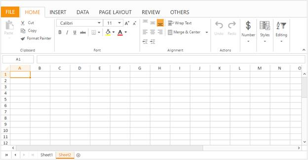
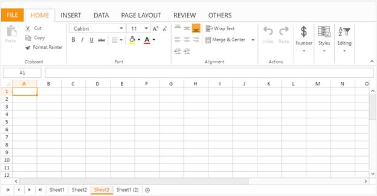
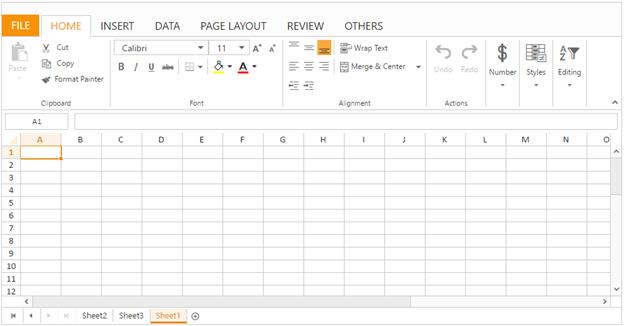
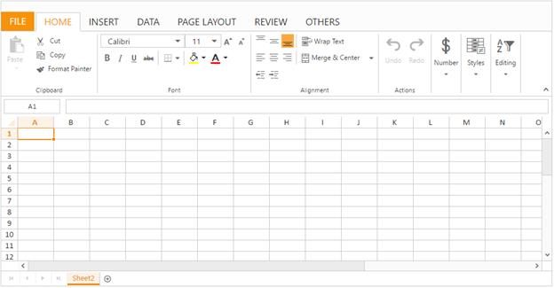
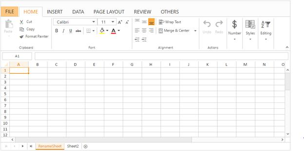
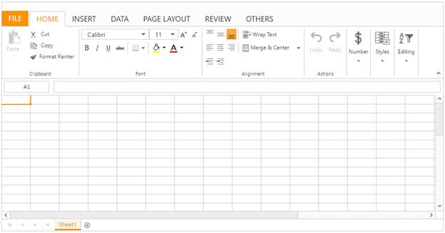
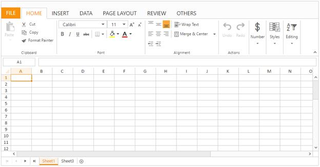
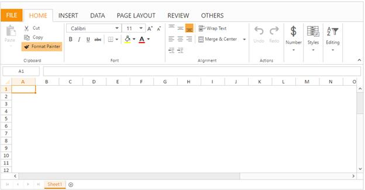

---
layout: post
title: Worksheets with Spreadsheet widget for Syncfusion Essential ASP.NET MVC
description: How to use and customize the Spreadsheet Worksheet
platform: ejmvc
control: Spreadsheet
documentation: ug
keywords: 
--- 

# Worksheet
Worksheet is a collection of cells organized in the form of rows and columns that allow us to store, format, manipulate and display data in grid format. You can create multiple sheets in Spreadsheet and use sheet tab for switching between those worksheets. By default, Spreadsheet creates single worksheet since default `sheetCount` value is `1`.

## List of Sheet Operation 
The following list of operations done within the Worksheet are
 
* Add
* Remove
* Rename
* Move and Copy

### Add
The Spreadsheet has support for inserting new sheet. You can insert sheet into two ways.

* Add a new sheet as last sheet.
* Insert a new sheet before the active sheet.

### Add Sheet
You can dynamically add a sheet by one of the following ways,

* Click the New sheet button in the spreadsheet sheet tab.
* Using `addNewSheet` method.

### Insert Sheet
You can dynamically insert a sheet by one of the following ways,

* Right clicking on the worksheet in the sheet tab and then click Insert option in the context menu.
* Click OTHERS tab in the ribbon and select Insert Sheet option in Insert dropdown button.
* Using `insertSheet` method.

The following code example describes the above behavior



@(Html.EJ().Spreadsheet<object>("Spreadsheet")
    .ClientSideEvents(events => events.LoadComplete("loadComplete"))
)

    


The following output is displayed as a result of the above code example.

### Copy
The Spreadsheet provides support to create a copy of an existing worksheet. You can dynamically copy a worksheet by using one of the following ways,

* Right clicking on the worksheet in the sheet tab and then click Move or Copy in the context menu. Check the “Create a copy” checkbox in the “Move or Copy” dialog.
* Copy an existing worksheet using `copySheet` method.

The following code example describes the above behavior



@(Html.EJ().Spreadsheet<object>("Spreadsheet")
    .SheetCount(3)
    .ClientSideEvents(events => events.LoadComplete("loadComplete"))
)

    


The following output is displayed as a result of the above code example.

### Move
The Spreadsheet provides support to move an existing worksheet. You can dynamically move a worksheet by using one of the following ways,

* Right clicking on the worksheet in the sheet tab and then click Move or Copy in the context menu. Select the sheet that you have to move in the “Move or Copy” dialog.
* Move an existing worksheet using `copySheet` method.

The following code example describes the above behavior


   
@(Html.EJ().Spreadsheet<object>("Spreadsheet")
    .SheetCount(3)
    .ClientSideEvents(events => events.LoadComplete("loadComplete"))
)

    


The following output is displayed as a result of the above code example.

### Remove
The Spreadsheet has support for removing an existing worksheet. You can dynamically remove the existing sheet by following ways,

* Right click on the worksheet in the sheet tab and then click Delete option in the context menu.
* Select the existing worksheet, Click OTHERS tab in the ribbon and select Delete dropdown button. Then click Delete Sheet.

You can also remove an active worksheet using `deleteSheet` method.

The following code example describes the above behavior



@(Html.EJ().Spreadsheet<object>("Spreadsheet")
    .SheetCount(2)
    .ClientSideEvents(events => events.LoadComplete("loadComplete"))
)

    


The following output is displayed as a result of the above code example.

### Rename
The Spreadsheet has support for renaming an existing worksheet. You can dynamically rename worksheet by using one of the following ways,

* Right clicking on the worksheet in the sheet tab and then click Rename option in the context menu.
* Rename an active worksheet using `sheetRename` method.

The following code example describes the above behavior



@(Html.EJ().Spreadsheet<object>("Spreadsheet")
    .SheetCount(2)
    .ClientSideEvents(events => events.LoadComplete("loadComplete"))
)



The following output is displayed as a result of the above code example.

## Headers
Headers in the spreadsheet are numbered rows and lettered columns in worksheets. It makes ease of view and reference to your data. You can dynamically show/ hide worksheet header by using one of the following ways,

* Select PAGE LAYOUT tab in the ribbon and uncheck Headings in the Show group.
* Show/Hide the worksheet headers using `showHeadings` property and `showHeadings` method.

The following code example describes the above behavior



@(Html.EJ().Spreadsheet<object>("Spreadsheet")
    .ClientSideEvents(events => events.LoadComplete("loadComplete"))
)

    


The following output is displayed as a result of the above code example.

## Show / Hide Sheets
You can dynamically show/ hide worksheet by using one of the following ways,

* Right clicking on the worksheet in the sheet tab and then click Hide or Unhide in the context menu
* Hide the sheet using ‘hideSheet’ method.
* Show the hidden sheet using `unhideSheet` method.

The following code example describes the above behavior



@(Html.EJ().Spreadsheet<object>("Spreadsheet")
    .SheetCount(3)
    .ClientSideEvents(events => events.LoadComplete("loadComplete"))
)



The following output is displayed as a result of the above code example.

## Show / Hide Gridlines
Gridlines act as a border like appearance of cells. They are used to distinguish cells on the worksheet. You can dynamically show/hide gridlines by using one of the following ways,

* Select PAGE LAYOUT tab in the ribbon and uncheck Gridlines in the Show group.
* Show/Hide gridlines in a worksheet using `showGridlines` property and ‘showGridlines’ method.

The following code example describes the above behavior



@(Html.EJ().Spreadsheet<object>("Spreadsheet")
    .Sheets(sheet =>
    {
        sheet.ShowGridlines(false).Add();
    })
)



The following output is displayed as a result of the above code example.

