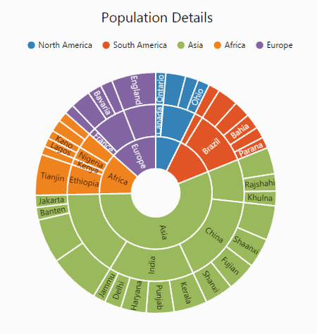
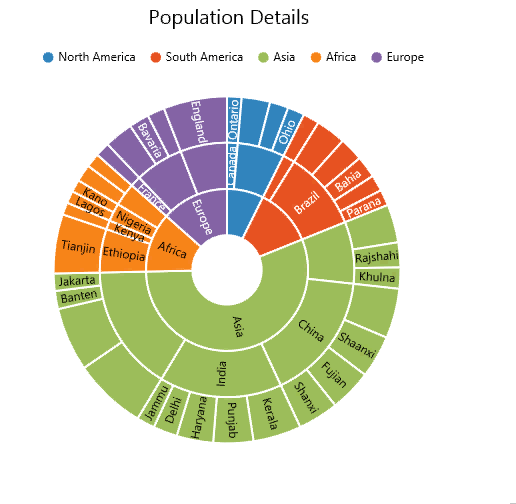

# Animation

Sunburst chart allows you to animate the chart segments. You can enable animation using **EnableAnimation** property. 



@(Html.EJ().SunburstChart("chartContainer")

     //...Enable Animation
      .EnableAnimation(true)
      //...
 )



## Animation Types 
Sunburst chart provide options to animate the chart segments in different ways using **AnimationType** property.
FadeIn – It gradually changes opacity of the chart segment.
Rotation – During an animation, control rotate from 0 to 360 angle.

### Fade In

The Fade In animation is enabled as follows 



@(Html.EJ().SunburstChart("chartContainer")

     //...Enable Animation
      .EnableAnimation(true)
      .SunburstAnimationType(SunburstAnimationType.FadeIn)
      //...
 )



### Rotation

The following example shows how to enable rotation animation in ejSunburstChart


@(Html.EJ().SunburstChart("chartContainer")

     //...Enable Animation
      .EnableAnimation(true)
      .SunburstAnimationType(SunburstAnimationType.Rotation)
      //...
 )



[Click](http://mvc.syncfusion.com/demos/web/sunburst/animation) here to view the online demo sample of  Animation in  the Sunburst Chart.
