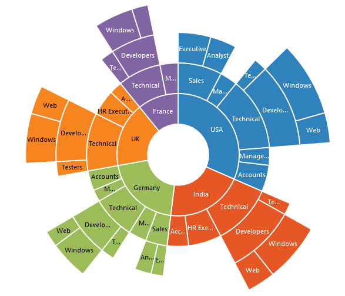

# Data Label in ASP.NET MVC SunburstChart 

Sunburst data labels are used to display the data related to the segment. It helps to provide the information about the data points to the users.
You can enable or disable the data labels by setting the visible property of the **DataLabelSettings** to true as shown in the below code



@(Html.EJ().SunburstChart("chartContainer")

     //...Palette colors
    .DataLabelSettings(dt => dt.Visible(true))
      //...
 )



## Label Overflow mode

When you represent huge data with data labels, they may intersect each other. You can avoid this using the *SunburstLabelOverflowMode* property.

The following properties are used to avoid the overlapping.
*	Trim – To trim the large data labels.
*	Hide – To hide the overlapped data labels.
The following code shows how to set Hide and Trim mode.


@(Html.EJ().SunburstChart("chartContainer")

     //.
    .DataLabelSettings(dt => dt.Visible(true).SunburstLabelOverflowMode(SunburstLabelOverflowMode.Hide))
      //...
 )

 

 



@(Html.EJ().SunburstChart("chartContainer")

     //.
    .DataLabelSettings(dt => dt.Visible(true).SunburstLabelOverflowMode(SunburstLabelOverflowMode.Trim))
      //...
 )

 

## Label Rotation Mode
You can rotate the data label by using *SunburstLabelRotationMode* property. By default, the labelRotationMode is set as **angle**. 

The following code shows how to set labelRotationMode as normal and angle.



@(Html.EJ().SunburstChart("chartContainer")

     //.
    .DataLabelSettings(dt => dt.Visible(true).SunburstLabelRotationMode(SunburstLabelRotationMode.Normal)
      //...
 )

 



@(Html.EJ().SunburstChart("chartContainer")

     //.
    .DataLabelSettings(dt => dt.Visible(true).SunburstLabelRotationMode(SunburstLabelRotationMode.Angle)
      //...
 )



 
## Customizing the data labels

You can customize the appearance of the data point using the `Font` property.



@(Html.EJ().SunburstChart("chartContainer")

     //.
    .DataLabelSettings(dt => dt.Visible(true).Font(font=>font.Color("Black").Font-Weight("Bold").Size("15px")))
      //...
 )



