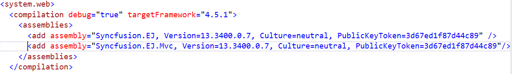

# Getting Started

This section explains you the steps required to populate the SunburstChart , add data labels, tooltips and title to the SunburstChart. This section covers only the minimal features that you need to know to get started with the SunburstChart.

## Installation and Deployment

It describes you on how to configure the Syncfusion dependencies in your ASP.NET MVC application to create a SunburstChart.

### Referencing Syncfusion Assemblies

The following assemblies need to be referenced in your application for using Essential SunburstChart MVC

1. Syncfusion.EJ.dll
2. Syncfusion.EJ.MVC.dll

Follow the steps given below to deploy the application in the development server by referencing the assembly in **GAC**.

* Web.config file should be configured according to the referenced assemblies. 
* To deploy your application, you have to ensure that the above referenced assemblies (in your web.config files) are present in the GAC.

And, add Syncfusion namespace in the Web.config file of Views folder to generate SunburstChart builder code in View page.

 

N> If you are referring Syncfusion dll's manually from bin folder to create MVC SunburstChart, then remove Culture, Version and PublicKeyToken attributes used in all, and nodes.

###  Adding script reference

Add the below scripts references and Syncfusion **ScriptManager** to execute the script as mentioned in the following code snippet in layout page.



    <!--  jquery script  -->
    
    
    <!-- Essentialcshtml UI widget -->
    
    
    <!--Add Syncfusion Script Manager -->
    @Html.EJ().ScriptManager()



To render the MVC Chart in unobtrusive mode refer **ej.unobtrusive.js** script file. Otherwise set false to **UnobtrusiveJavaScriptEnabled** in Web.config file.

In the above code, ej.web.all.min.js script reference has been added for demonstration purpose. It is not recommended to use this for deployment purpose, as its file size is larger since it contains all the widgets. Instead, you can use [`CSG`](http://csg.syncfusion.com/) utility to generate a custom script file with the required widgets for deployment purpose.

## Initialize Sunburst Chart

Add the following code in the index.cshtml file to create the SunburstChart control in View page.



    @(Html.EJ().SunburstChart("chartContainer"))



## Populate Data source:

Now, let’s see how to plot data source to the SunburstChart. First, let us generate a data source containing following fields in controller.



 public class DefaultData
    {
        public string Category { get; set; }
        public string Country { get; set; }
        public string JobDescription { get; set; }
        public string JobGroup { get; set; }
        public string JobRole { get; set; }
        public int EmployeesCount { get; set; }

        public static List<DefaultData> GetDefaultData()
        {
            List<DefaultData> data = new List<DefaultData>();
           data.Add(new DefaultData() { Category = "Employees", Country = "USA", JobDescription = "Sales",         JobGroup ="Executive",                         EmployeesCount= 50});
           data.Add(new DefaultData() { Category = "Employees", Country = "USA", JobDescription = "Sales",         JobGroup = "Analyst",                         EmployeesCount =40 });
           data.Add(new DefaultData() { Category = "Employees", Country = "USA", JobDescription = "Marketing",                                                  EmployeesCount =40 });
           data.Add(new DefaultData() { Category = "Employees", Country = "USA", JobDescription = "Technical",     JobGroup = "Testers",                         EmployeesCount =55 });
           data.Add(new DefaultData() { Category = "Employees", Country = "USA", JobDescription = "Technical",     JobGroup = "Developers", JobRole = "Windows", EmployeesCount =175});
           data.Add(new DefaultData() { Category = "Employees", Country = "USA", JobDescription = "Technical",     JobGroup = "Developers", JobRole = "Web",     EmployeesCount =70 });
           data.Add(new DefaultData() { Category = "Employees", Country = "USA", JobDescription = "Management",                                                  EmployeesCount =40 });
           data.Add(new DefaultData() { Category = "Employees", Country = "USA", JobDescription = "Accounts",                                                    EmployeesCount =60 });
           
           data.Add(new DefaultData() { Category = "Employees", Country = "India",   JobDescription = "Technical",     JobGroup = "Testers",                         EmployeesCount = 43 });
           data.Add(new DefaultData() { Category = "Employees", Country = "India",   JobDescription = "Technical",     JobGroup = "Developers", JobRole = "Windows", EmployeesCount = 125});
           data.Add(new DefaultData() { Category = "Employees", Country = "India",   JobDescription = "Technical",     JobGroup = "Developers", JobRole = "Web",     EmployeesCount = 60 });
           data.Add(new DefaultData() { Category = "Employees", Country = "India",   JobDescription = "HR Executives",                                              EmployeesCount = 70 });
           data.Add(new DefaultData() { Category = "Employees", Country = "India",   JobDescription = "Accounts",                                                   EmployeesCount = 45 });
          
           data.Add(new DefaultData() { Category = "Employees", Country = "Germany", JobDescription = "Sales",         JobGroup = "Executive",                       EmployeesCount = 30 });
           data.Add(new DefaultData() { Category = "Employees", Country = "Germany", JobDescription = "Sales",         JobGroup = "Analyst",                         EmployeesCount = 40 });
           data.Add(new DefaultData() { Category = "Employees", Country = "Germany", JobDescription = "Marketing",                                                  EmployeesCount = 50  });
           data.Add(new DefaultData() { Category = "Employees", Country = "Germany", JobDescription = "Technical",     JobGroup = "Testers",                         EmployeesCount = 40 });
           data.Add(new DefaultData() { Category = "Employees", Country = "Germany", JobDescription = "Technical",     JobGroup = "Developers", JobRole = "Windows", EmployeesCount = 65 });
           data.Add(new DefaultData() { Category = "Employees", Country = "Germany", JobDescription = "Technical",     JobGroup = "Developers", JobRole = "Web",     EmployeesCount = 27 });
           data.Add(new DefaultData() { Category = "Employees", Country = "Germany", JobDescription = "Management",                                                 EmployeesCount = 33  });
           data.Add(new DefaultData() { Category = "Employees", Country = "Germany", JobDescription = "Accounts",                                                   EmployeesCount = 55  });
           
           data.Add(new DefaultData() { Category = "Employees", Country = "UK",      JobDescription = "Technical",     JobGroup = "Testers",                         EmployeesCount = 45 });
           data.Add(new DefaultData() { Category = "Employees", Country = "UK",      JobDescription = "Technical",     JobGroup = "Developers", JobRole = "Windows", EmployeesCount = 96 });
           data.Add(new DefaultData() { Category = "Employees", Country = "UK",      JobDescription = "Technical",     JobGroup = "Developers", JobRole = "Web",     EmployeesCount = 55 });
           data.Add(new DefaultData() { Category = "Employees", Country = "UK",      JobDescription = "HR Executives",                                               EmployeesCount = 60 });
           data.Add(new DefaultData() { Category = "Employees", Country = "UK",      JobDescription= "Accounts",                                                     EmployeesCount=30   });
           
           data.Add(new DefaultData() { Category = "Employees", Country = "France", JobDescription= "Technical",     JobGroup = "Testers",                         EmployeesCount = 40 });
           data.Add(new DefaultData() { Category = "Employees", Country = "France", JobDescription= "Technical",     JobGroup = "Developers", JobRole = "Windows", EmployeesCount = 65 });
           data.Add(new DefaultData() { Category = "Employees", Country = "France", JobDescription= "Technical",     JobGroup = "Developers", JobRole = "Web",     EmployeesCount = 27 });
           data.Add(new DefaultData() { Category = "Employees", Country = "France", JobDescription="Marketing",                                                     EmployeesCount= 50 });
           return data; 
        }
    }



### Initialize Sunburst Chart with data
Now, bind the DefaultData to `DataSource` property of the Sunburst Chart. The`Levels`property determines the number of hierarchical levels. Each hierarchy level is formed based on the property specified in `GroupMemberPath` property, and each arc segment size is calculated using `ValueMemberPath`.

2. Add SunburstChart() action in SunburstChartController and add the following code.



public ActionResult SunburstChart()
        {
            ViewData["defaultData"] = DefaultData.GetDefaultData();            
            return View();
        }



3.Render the SunburstChart with the Datasource and Levels,the following code snippet is used 



@{
       var datasource = ViewData["defaultData"];       
    }
@(Html.EJ().SunburstChart("chartContainer")
                    .ValueMemberPath("EmployeesCount")
                    .DataSource(datasource)
                    .Levels(lv =>
                    { 
                        lv.GroupMemberPath("Country").Add();
                        lv.GroupMemberPath("JobDescription").Add();
                        lv.GroupMemberPath("JobGroup").Add();
                        lv.GroupMemberPath("JobRole").Add();
                    }))


3. The final CSHTML file appears as follows



@using Syncfusion.JavaScript.DataVisualization
           
    @{

		var datasource = ViewData["datasource"];    

	}
	<html xmlns="http://www.w3.org/1999/xhtml">

	<head> 

	 <!--  jquery script  -->
    
    
    <!-- Essentialcshtml UI widget -->
    
    
	

	@(Html.EJ().SunburstChart("chartContainer")
                    .ValueMemberPath("EmployeesCount")
                    .DataSource(datasource)
                    .Levels(lv =>
                    { 
                        lv.GroupMemberPath("Country").Add();
                        lv.GroupMemberPath("JobDescription").Add();
                        lv.GroupMemberPath("JobGroup").Add();
                        lv.GroupMemberPath("JobRole").Add();
                    }))
		
   

@(Html.EJ().ScriptManager())

	
	</body>

	</html>



## Add Title to the Sunburst Chart

The title of the Sunburst chart is used to provide quick information to the user about the data being plotted in the Sunburst Chart. You can add it by using the `Text` property of the **Title** 



 @(Html.EJ().SunburstChart("chartContainer")

     //...Enable Text
      .Title(ti => ti.Text("Employees Count"))

 )



## Enable Legend

You can enable or disable the legend by using the `Visible` property present inside the **Legend**



@(Html.EJ().SunburstChart("chartContainer")

     //...Enable Legend
      .Legend(li => li.Visible(true))

 )



## Add Data Labels

The data labels are used to improve the readability of the Sunburst chart. This can be achieved by enabling the `visible` property in the **DataLabelSettings**



 @(Html.EJ().SunburstChart("chartContainer")

     //...Enable DataLabel 
       .DataLabelSettings(dt => dt.Visible(true))

 )



Now the Sunburst Chart is rendered along with the specified customizations

[Click](http://mvc.syncfusion.com/demos/web/sunburst/default) here to view the default sample of the Sunburst Chart.
