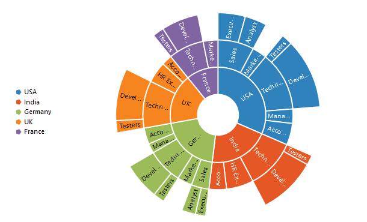
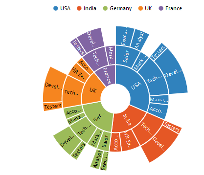
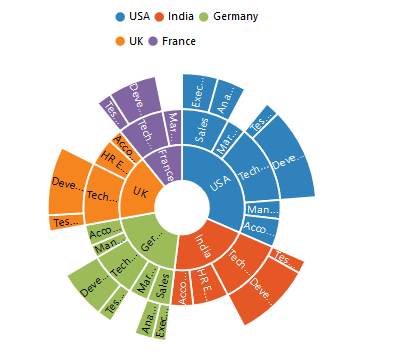

## Legend
The legend is used to represent the first level of items in the Sunburst Chart.The **Legend** can be initialized using the below code snippet



@(Html.EJ().SunburstChart("chartContainer")

      .Legend(lg => lg.Visible(true))
 )

 

## Legend Icon 

You can specify different shapes of legend icon by using the **Shape** property of the legend. By default, legend shape is **Circle**. The Sunburst chart has some predefined shapes such as:

* Circle
* Cross
* Diamond
* Pentagon
* Rectangle
* Triangle



@(Html.EJ().SunburstChart("chartContainer")

      .Legend(lg => lg.Visible(true).Shape(SunburstLegendShape.Pentagon))
 )



 
## Positioning the Legend

By using the **Position** property, you can position the legend at left, right, top or bottom of the chart. 



@(Html.EJ().SunburstChart("chartContainer")

      .Legend(lg => lg.Visible(true).Position(SunburstLegendPosition.Top))
 )
 



 
### Customization

## Legend Item Size and border
You can change the size of the legend items by using the **LegendItemStyle-Width** and **LegendItemStyle-Height** properties. To change the legend item border, use **Border** property of the legend .



@(Html.EJ().SunburstChart("chartContainer")

      .Legend(lg => lg.Visible(true).Position(SunburstLegendPosition.Top).LegendItemStyle(lt=>lt.Width(13).Height(13)).Border(br=>br.Color("#FF0000").Width(1)))
 )
 


## Legend Size

By default, legend takes 20% of the height horizontally when it was placed on the top or bottom position and 20% of the width vertically while placing on the left or right position of the chart. You can change this default legend size by using the **Size** property of the legend.



@(Html.EJ().SunburstChart("chartContainer")

      .Legend(lg => lg.Visible(true).Position(SunburstLegendPosition.Top).Size(size=>size.Width(200).Height(75)))
 )



 

## Legend Row and Columns

You can arrange the legend items horizontally and vertically by using the **RowCount** and **ColumnCount** properties of the legend.
•	When only the rowCount is specified, the legend items are arranged according to the rowCount and number of columns may vary based on the number of legend items.
•	When only the columnCount is specified, the legend items are arranged according to the columnCount and number of rows may vary based on the number of legend items.
•	When both the properties are specified, then the one which has higher value is given preference. For example, when the rowCount is 4 and columnCount is 3, legend items are arranged in 4 rows.
•	When both the properties are specified and have the same value, the preference is given to the columnCount when it is positioned at the top/bottom position. The preference is given to the rowCount when it is positioned at the left/right position.
 


@(Html.EJ().SunburstChart("chartContainer")

      .Legend(lg => lg.Visible(true).RowCount(2).ColumnCount(3))
 )



 
## LegendInteractivity

You can select a specific category while clicking on corresponding legend item through **ClickAction** property. 

It has three types of action
*	ToggleSegmentSelection
*	ToggleSegmentVisibility
*	None

## ToggleSegmentSelection

Used to highlight specific category while clicking on legend item


@(Html.EJ().SunburstChart("chartContainer")

      .Legend(lg => lg.Visible(true).ClickAction(SunburstLegendClickAction.ToggleSegmentSelection))
 )



 
## Toggle Segment Visibility

Used to disable the specific category while clicking on legend item.



@(Html.EJ().SunburstChart("chartContainer")

      .Legend(lg => lg.Visible(true).ClickAction(SunburstLegendClickAction.ToggleSegmentVisibility))
 )


