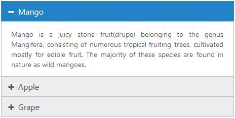

# Syntax for VB

Since our Syncfusion ASP.NET MVC components can render the control either by using **C#** or **VB**. As only the control declaration syntax varies across languages and other functionalities are usually performed in the client-side.

The following example code depicts the VB syntax to be used within the server-side wrapper declaration – **to** **create** **an** **Accordion** **control** using lambda expression,



    @Code 

    Html.EJ().Accordion("basicAccordion").Items(Sub(data)

      data.Add().Text("Mango").ContentTemplate(Sub()@
 Mango is a juicy stone fruit(drupe) belonging to the genus Mangifera, consisting of numerous tropical fruiting trees, cultivated mostly for edible fruit. The majority of these species are found in nature as wild mangoes.
End Sub)

      data.Add().Text("Apple").ContentTemplate(Sub()@
Apple is a sweet, pomaceous fruit originated in Central Asia, where its wild ancestor, Malus sieversii, is still found today. Apples have been grown for thousands of years in Asia and Europe, and were brought to North America by European colonists.
 End Sub)

      data.Add().Text("Grapes").ContentTemplate(Sub()@
Grapes are a non-climacteric type of fruit, generally occurring in clusters. It is a fruiting berry of the deciduous woody vines of the botanical genus Vitis. The cultivation of the domesticated grape began 6,000–8,000 years ago in the Near East.
 End Sub)

    End Sub).Render()

    End Code



The output for the above code will look like the one as shown below,

