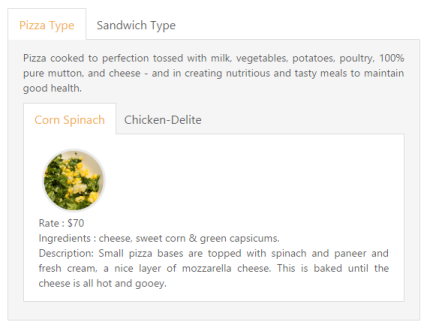

# Ajax Content Load (Load on Demand)

You can change the contents in sub Tab element periodically and you are provided with a support to change the contents without any problems. To achieve the content load, use the Load on Demand concept.

In Load On-Demand, the external HTML file with the necessary details is referred in url section during Tab header declaration section. Also include “DataType”, “ContentType”, and “Asnync” in the script like the following example when rendering the control. When you click the Tab header, the Ajax automatically calls the content from the external files and displays in a Tab content section. 

## Sub Tab with Ajax Content

Each item has a variety of options and these options are also specified in the limited space. So you can choose the Tab control that is used within the root Tab to specify more details.

1. Add the following code in your view page to render sub Tab with ajax content.

   ~~~ cshtml

	// Add the following code example to the corresponding CSHTML page to render sub Tab with ajax content.

	@{Html.EJ().Tab("DishType").Items(data =>

		 {

			 data.Add().ID("Pizzatype").Text("Pizza Menu").ContentTemplate(@

				Pizza cooked to perfection tossed with milk, vegetables, potatoes, poultry, 100% pure mutton, and cheese - and in creating nutritious and tasty meals to maintain good health.

				@firstTab()

			
);

			 data.Add().ID("sandwitchtype").Text("Sandwizza Menu").ContentTemplate(@

				Sandwizza cooked to perfection tossed with bread, milk, vegetables, potatoes, poultry, 100% pure mutton, and cheese - and in creating nutritious and tasty meals to maintain good health.

				@secondTab()

			
);

			 data.Add().ID("Pastatype").Text("Pasta Menu").ContentTemplate(@

				Pasta cooked to perfection tossed with milk, vegetables, potatoes, poultry, 100% pure mutton, and cheese - and in creating nutritious and tasty meals to maintain good health.

			
);

		 }).Render();

		@helper firstTab()

			{

			@Html.EJ().Tab("PizzaType").Items(data =>

			  {	

				  data.Add().ID("Corn-Spinach").Text("Corn Spinach").Url("Content/cornSpinach.html");

				  data.Add().ID("ChickenDelite").Text("Chicken-Delite").Url("Content/chickenDelite.html");

			  })

			}

		@helper secondTab()

		{

		@Html.EJ().Tab("sandwichtype").Items(data =>

			{

				data.Add().ID("gardenveggie").Text("Corn Spinach").Url("Content/gardenVeggie.html");

				data.Add().ID("chickentikka").Text("Chicken-Delite").Url("Content/chickenTikka.html"); data.Add().ID("PaneerTikka").Text("PaneerTikka").Url("Content/paneerTikka.html");

			})

		}

	}

   ~~~
   

2. The file ‘cornSpinach.html’ content is as follows. 
   
   ~~~ cshtml
        

	<!DOCTYPE html>

	<html xmlns="http://www.w3.org/1999/xhtml">

	<body>

		

		

		

			Rate    : $70  Ingredients : cheese, sweet corn &amp; green capsicums.

			 

			Description: Small pizza bases are topped with spinach and paneer and fresh cream, a nice layer of mozzarella cheese. This is baked until the cheese is all hot and gooey.                    

		
   

	</body>

	</html>

   ~~~
   

3. The file ‘chickenDelite.html’ content is as follows.

   ~~~ cshtml

	<!DOCTYPE html>

	<html xmlns="http://www.w3.org/1999/xhtml">

	<body>

		

		

		

			Rate    : $100  Ingredients : cheese, chicken chunks, onions &amp; pineapple chunks.     

			 Description: This is a tasty, elegant chicken dish that is easy to prepare.

		

		

	</body>

	</html>

   ~~~
   

The following screenshot illustrates the First Tab with the sub Tab control using Load on Demand. 

Tab section with sub Tab control using Load on Demand.
{:.caption}

