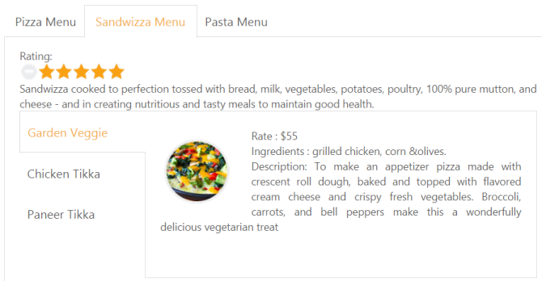
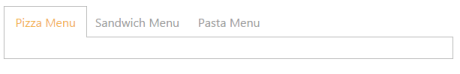
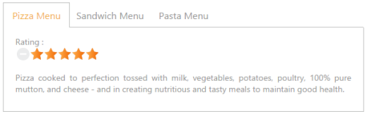
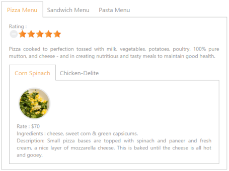
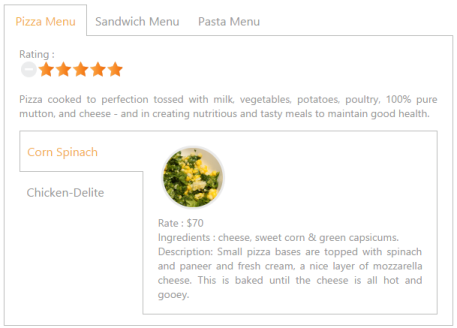
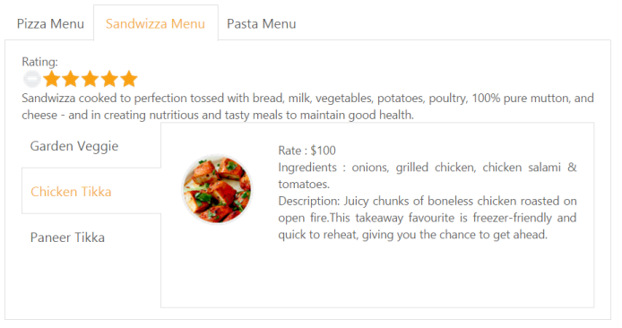

# Getting Started 

This section explains briefly about how to create a Tab Control in your application with ASP.NET MVC.

## Create your first Tab Control in MVC

The ASP.NET MVCTab control is an interface that displays the content in multiple sections. A TabPanel consists of HeaderText as well as a ContentTemplate. Tab is useful for a dashboard that is having limited space. The following section guides you to customize the Tab for displaying Hotel menu items, its rate details and the ingredients on demand.

Tab control with Hotel Menu items
{:.caption}

### Create Tab Control

The ASP.NET MVCTab widget basically builds a dynamic, interactive, menu-driven interface from your content. The content can be text, graphics or HTML. You can create the Tab headers using Text and Content templateproperty

The following steps are used to create Tab control.  

1. You can create an MVC Project and add necessary Dll and script with the help of the given [MVC-Getting Started](http://help.syncfusion.com/aspnetmvc/tab/getting-started) Documentation.
2. Add the mentioned code to the corresponding view page for Tab rendering.

   ~~~ cshtml

	@Html.EJ().Tab("DishType").Items(data =>

	{

		data.Add().ID("pizzamenu").Text("Pizza Menu").ContentTemplate(@

);

		data.Add().ID("pizzatype").Text("Pizza Type").ContentTemplate(@

);

		data.Add().ID("sandwichtype").Text("Sandwich Type").ContentTemplate(@

);

	})

   ~~~
   

The following output is displayed.

' 

Tab control with Header

{:.caption}

### Configure Content

In this application, a detailed description is provided to each item. You can specify the contents in the Tab section within the Content template. 



@Html.EJ().Tab("DishType").Items(data =>

{

data.Add().ID("pizzamenu").Text("Pizza Menu").ContentTemplate(@
 Rating:

@Html.EJ().Rating("RatingPizza").Value(4).Precision(Precision.Exact)

<!--Food item description-->

Pizza cooked to perfection tossed with milk, vegetables, potatoes, poultry, 100% pure mutton, and cheese - and in creating nutritious and tasty meals to maintain good health.

);

})



You can provide more customization to the Tab by using rating control, to describe an item’s price.

### Create the Rating 

The ASP.NET MVCRating control provides an intuitive rating experience that allows you to select the number of stars that represents the rating. The following code example explains you the creation of rating control. We can create the Rating control using html helper. We can render the rating control and its description inside the content template of first tab control.

For more information about rating, refer to the following link: 

<http://help.syncfusion.com/aspnetmvc>



<!--Use the following codes with above Html contents-->

@Html.EJ().Tab("DishType").Items(data =>

{

data.Add().ID("pizzamenu").Text("Pizza Menu").ContentTemplate(@
 Rating:

@Html.EJ().Rating("RatingPizza").Value(4).Precision(Precision.Exact)

<!--Food item description-->

Pizza cooked to perfection tossed with milk, vegetables, potatoes, poultry, 100% pure mutton, and cheese - and in creating nutritious and tasty meals to maintain good health.

);

data.Add().ID("pizzatype").Text("Pizza Type").ContentTemplate(@

);

data.Add().ID("sandwichtype").Text("Sandwich Type").ContentTemplate(@

);

})



The following screenshot is the output for the given code example.

### Sub Tab with Content 

Each item has a variety of options, and these options are also specified in the limited space. So you can choose the Tab control that is used within the root Tab to specify more details.

The following code example represents sub Tab control rendering using helper function.



<!--Use the following codes with in the  above Html -->

  @Html.EJ().Tab("DishType").Items(data =>

{

    data.Add().ID("pizzamenu").Text("Pizza Menu").ContentTemplate(@
 Rating:

    @Html.EJ().Rating("RatingPizza").Value(4).Precision(Precision.Exact)

<!--Food item description-->

    
Pizza cooked to perfection tossed with milk, vegetables, potatoes, poultry, 100% pure mutton, and cheese - and in creating nutritious and tasty meals to maintain good health.

       @firstTab()

);

    data.Add().ID("pizzatype").Text("Pizza Type").ContentTemplate(@

);

    data.Add().ID("sandwichtype").Text("Sandwich Type").ContentTemplate(@

);

})

@helper firstTab()

{

    @Html.EJ().Tab("PizzaMenu").Items(data =>

    {

        data.Add().ID("Corn-Spinach").Text("Corn Spinach").ContentTemplate(@

            

            

                Rate    : $70 

                Ingredients : cheese, sweet corn &amp; green capsicums.

                 

                Description: Small pizza bases are topped with spinach and paneer and fresh cream, a nice layer of mozzarella cheese. This is baked until the cheese is all hot and gooey.

            

        

);

        data.Add().ID("ChickenDelite").Text("Chicken-Delite").ContentTemplate(@

    

    

        Rate    : $100 

        Ingredients : cheese, chicken chunks, onions &amp; pineapple chunks.

         

        Description: This is a tasty, elegant chicken dish that is easy to prepare.

    

        );

    })

});

}



The following code example is used to position the image and content.





The following screenshot illustrates the first Tab with the sub Tab control.

### Orientation Change

Now, you can learn how to set the sub Tab orientation to vertical. By default, Tab control is rendered in horizontal orientation. You can change this orientation to vertical by using the HeaderPosition property. In the following code section, set the Tab header orientation as Left.

The following code section renders the sub Tab element in the vertical orientation.



<!--Use the following codes with in the  above Html -->

    @Html.EJ().Tab("DishType").Items(data =>

{

    data.Add().ID("pizzamenu").Text("Pizza Menu").ContentTemplate(@

        Rating:

        @Html.EJ().Rating("RatingPizza").Value(4).Precision(Precision.Exact)

        <!--Food item description-->

        
Pizza cooked to perfection tossed with milk, vegetables, potatoes, poultry, 100% pure mutton, and cheese - and in creating nutritious and tasty meals to maintain good health.

        @firstTab()

    
);

    data.Add().ID("pizzatype").Text("Pizza Type").ContentTemplate(@

);

    data.Add().ID("sandwichtype").Text("Sandwich Type").ContentTemplate(@

);

})

    @helper firstTab()

{

    @Html.EJ().Tab("PizzaMenu").HeaderPosition(HeaderPosition.Left).Height("221").Items(data =>

    {

        data.Add().ID("Corn-Spinach").Text("Corn Spinach").ContentTemplate(@

            

            

                Rate    : $70 

                Ingredients : cheese, sweet corn &amp; green capsicums.

                 

                Description: Small pizza bases are topped with spinach and paneer and fresh cream, a nice layer of mozzarella cheese. This is baked until the cheese is all hot and gooey.

            

        

);

        data.Add().ID("ChickenDelite").Text("Chicken-Delite").ContentTemplate(@

            

            

                Rate    : $100 

                Ingredients : cheese, chicken chunks, onions &amp; pineapple chunks.

                 

                Description: This is a tasty, elegant chicken dish that is easy to prepare.

            

        

        );

    })

});



The following screenshot is the output of above steps.

### Configure Contents to remaining Tab items

The second and third Tab contents are declared in the same method as of the first Tab content declaration. These Tabs also consist of rating and sub Tab controls. 



@{Html.EJ().Tab("DishType").Items(data => 
        {
			data.Add().ID("Pizzatype").Text("Pizza Menu").ContentTemplate(@
 
			Pizza cooked to perfection tossed with milk, vegetables, potatoes, poultry, 100% pure mutton, and cheese - and in creating nutritious and tasty meals to maintain good health.
			@firstTab()
            
);
			data.Add().ID("sandwitchtype").Text("Sandwizza Menu").ContentTemplate(@

			Sandwizza cooked to perfection tossed with bread, milk, vegetables, potatoes, poultry, 100% pure mutton, and cheese - and in creating nutritious and tasty meals to maintain good health. 
			@secondTab() 
			
);  
			data.Add().ID("Pastatype").Text("Pasta Menu").ContentTemplate(@

			
);  
		}).Render();

		@helper secondTab(){ 
		   @Html.EJ().Tab("SandwichMenu").HeaderPosition(HeaderPosition.Left).Height("221").Items(data =>
		   {       
				data.Add().ID("GardenVeggie").Text("Garden Veggie").ContentTemplate(@

				 
				
 
				Rate    : $55   
				Ingredients : grilled chicken, corn &amp;olives.
				     
				Description: To make an appetizer pizza made with crescent roll dough, baked and topped with flavored cream cheese and crispy fresh vegetables.
				Broccoli, carrots, and bell peppers make this a wonderfully delicious vegetarian treat
				
 
				
);
				data.Add().ID("ChickenTikka").Text("Chicken Tikka ").ContentTemplate(@
  
				 
				
  
				Rate    : $100  
				Ingredients : onions, grilled chicken, chicken salami &amp; tomatoes.   
				       
				Description: Juicy chunks of boneless chicken roasted on open fire.This takeaway favourite is freezer-friendly and quick to reheat, giving you the chance to get ahead. 
				
   
				
); 
				data.Add().ID("PaneerTikka").Text("Paneer Tikka  ").ContentTemplate(@
 
				 
				
 
				Rate    : $150  
				  
				Ingredients : onions, paneer & tomatoes.
				 
				Description: Delve into the tasty Paneer Tikka Kebabs made from marinated paneer or cottage cubes.
				Relish these grilled delicacies with green mint chutney and onion rings.
				
 
				
);
			})   
		}   
			



Add third Tab contents in element during initialization using content template option.


@{Html.EJ().Tab("DishType").Items(data =>  
   {   
		data.Add().ID("Pizzatype").Text("Pizza Menu").ContentTemplate(@

		Pizza cooked to perfection tossed with milk, vegetables, potatoes, poultry, 100% pure mutton, and cheese - and in creating nutritious and tasty meals to maintain good health.
		@firstTab()  
		
); 
		data.Add().ID("sandwitchtype").Text("Sandwizza Menu").ContentTemplate(@

		Sandwizza cooked to perfection tossed with bread, milk, vegetables, potatoes, poultry, 100% pure mutton, and cheese - and in creating nutritious and tasty meals to maintain good health. 
		@secondTab() 
		
); 
		data.Add().ID("Pastatype").Text("Pasta Menu").ContentTemplate(@

		Pasta cooked to perfection tossed with milk, vegetables, potatoes, poultry, 100% pure mutton, and cheese - and in creating nutritious and tasty meals to maintain good health.  
		@thirdTab() 
		
); 
		}).Render();   

 @helper thirdTab(){
 @Html.EJ().Tab("PastaMenu").HeaderPosition(HeaderPosition.Left).Height("221").Items(data =>
 {     
	data.Add().ID("KheemaPasta").Text("Kheema Pasta ").ContentTemplate(@

	 
	
 
	
     
	Rate : $30  
	Ingredients : chicken, onions, chilly, garlic &amp; tomatoes. 
	Description: Kheema pasta dish make with veg or non-veg type.It is delicious and can be served for dinner, brunch or evening snack. 
	
 
	
  
	
); 
	data.Add().ID("TunaPasta").Text("Tuna Pasta").ContentTemplate(@

	
	
  
	
     
	Rate : $55  
	Ingredients : tomato ,olive, oninor &amp;garlic.   
	Description: Canned tuna is used to make this yummy tomato sauce.
	
       
	
 
	
 );   
	data.Add().ID("ChannaPasta").Text("Channa Pasta").ContentTemplate(@
 
	 
	
   
	
              
	Rate : $30      
	Ingredients : sautered spinach mix, sweet corn, parsley &amp;mozarella cheese. .  
	Description: This is a pasta dish make with leftover channa masala (chole). This can be made from scratch too by making the channa masala first and then tossing in the cooked pasta. 
	
     
	
      
	
); 
	})     
	}


Apply the following styles to the Tab.





The following screenshot illustrates the second Tab contents in Tab and the final hotel menu with rating, description and ingredients of the item in the Tab interface.

