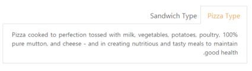

# RTL Support

Tab control provides support for load contents in right to left format. This is achieved by setting ‘EnableRTL’ property to “true”.

The following code example is used to render the Tab element in RTL format. 

1. Add the following code in your view page to render Tab with RTL format.

   ~~~ js

		// Add the following code example to the corresponding CSHTML page to render Tab in Rtl format.

		

			@{Html.EJ().Tab("dishtab").Items(data =>

				   {

					   data.Add().ID("pizzatype").Text("Pizza Type")

						   .ContentTemplate(@

							   Pizza cooked to perfection tossed with milk, vegetables, potatoes, poultry, 100% pure mutton, and cheese - and in creating nutritious and tasty meals to maintain good health.

						   
);

					   data.Add().ID("sandwichtype").Text("Sandwich Type")

						   .ContentTemplate(@
Sandwich cooked to perfection tossed with bread, milk, vegetables, potatoes, poultry, 100% pure mutton, and cheese - and in creating nutritious and tasty meals to maintain good health.

					   
);

				   }).EnableRTL(true).Render();}

		

   ~~~
   {:.prettyprint }

2. The following screenshot illustrates the Tab with RTL format.

