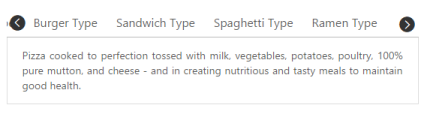

# Scroll Support

Tab control provides you scrolling support on Tab items to display a larger number of tabs with scroll buttons to get rid of the extending page size. The enabled Scroll buttons can be used to traverse through the elements.

By default, Tab header is rendered without scroll button. You can add the scroll button by setting the "EnableTabScroll" property to "true". When you move the cursor over the Tab header the scroll button is displayed.   

You can use the following code example to render the Tab widget with scroll button.

1. Add the following code in your view page to create a simple Tab with scroll button.



@*Add the following code example to the corresponding CSHTML page to render Tab with scroll button.*@

            @{Html.EJ().Tab("dishtab").Items(data =>

           {

               data.Add().ID("pizzatype").Text("Pizza Type")

                   .ContentTemplate(@
Pizza cooked to perfection tossed with milk, vegetables, potatoes, poultry, 100% pure mutton, and cheese - and in creating nutritious and tasty meals to maintain good health.
);

               data.Add().ID("pastatype").Text("Pasta Type")

                   .ContentTemplate(@
Pasta cooked to perfection tossed with milk, vegetables, potatoes, poultry, 100% pure mutton, and cheese - and in creating nutritious and tasty meals to maintain good health.
);

               data.Add().ID("burgertype").Text("Burger Type")

                   .ContentTemplate(@
Burger cooked to perfection tossed with milk, vegetables, potatoes, poultry, 100% pure mutton, and cheese - and in creating nutritious and tasty meals to maintain good health.
);

               data.Add().ID("sandwichtype").Text("Sandwich Type")

                   .ContentTemplate(@
Sandwich cooked to perfection tossed with bread, milk, vegetables, potatoes, poultry, 100% pure mutton, and cheese - and in creating nutritious and tasty meals to maintain good health.
);

               data.Add().ID("spaghettitype").Text("Spaghetti Type")

                   .ContentTemplate(@
Spaghetti cooked to perfection tossed with milk, vegetables, potatoes, poultry, 100% pure mutton, and cheese - and in creating nutritious and tasty meals to maintain good health.
);

               data.Add().ID("ramentype").Text("Ramen Type")

                   .ContentTemplate(@
Ramen cooked to perfection tossed with milk, vegetables, potatoes, poultry, 100% pure mutton, and cheese - and in creating nutritious and tasty meals to maintain good health.
);

           }).EnableTabScroll(true).Render();}

        



The following screenshot illustrates you the Tab control with scroll button. 

_Figure 24: Tab control with scroll support_

