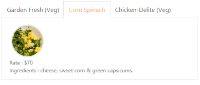

# Template Support

## ASP.NET MVC

The Content template option provided in MVC is used to specify the HTML elements inside the Tab control. We can use this option to load any HTML elements and showcase it in the Tab panels as per our requirement.

The following code block showcases how to use content template option in the Tab control.



    @{Html.EJ().Tab("pizzaMenu").Items(data =>

           {

               data.Add().ID("gardenfresh").Text("GARDEN FRESH (Veg)")

                   .ContentTemplate(@

                    

                    

                        Rate    : $50

                         

                        Ingredients : cheese, onions, green capsicums & tomatoes.

                    

                
);

               data.Add().ID("cornandspinach").Text("CORN & SPINACH (Veg)")

                   .ContentTemplate(@

                    

                    

                        Rate    : $70

                         

                        Ingredients : cheese, sweet corn & green capsicums.

                    

                
);

               data.Add().ID("chickendelite").Text("CHICKEN DELITE (Non-veg)")

                   .ContentTemplate(@

                    

                    

                        Rate    : $100

                         

                        Ingredients : cheese, chicken chunks, onions & pineapple chunks.

                    

                
);

           }).Render();}



Output:

_Figure 25: Tab control with template support_

