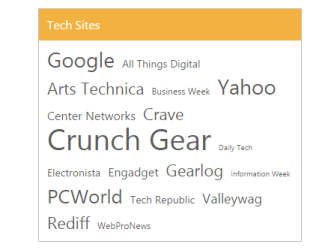
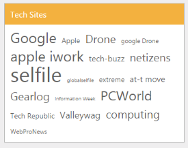
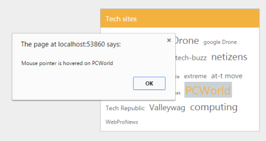

# Getting Started

This section explains briefly about how to create a TagCloud in your ASP.NET MVC application.

## Create your first TagCloud in MVC

ASP.NET MVC TagCloud provides support to display a weighted list, where the weight of each item is reflected by the size of the item's text. TagCloud is rendered as a link and as you click it, you can drill into the selected category. Refer the following guidelines to create TagCloud scenario. This allows you to display a weighted list.

{{ '' | markdownify }}
{:.image }

In the above screenshot, you can see the weighted list and a click on any item drills into the respective category.

Create a TagCloud 

Essential Studio ASP.NET MVC TagCloud widget has built-in features such as clicking on one of the sites in the TagCloud brings all relevant results only from the selected source. You can easily create the TagCloud widget element as follows.

1. You can create a MVC Project and add required assemblies, scripts and styles to it.  Refer [MVC-Getting Started.](http://help.syncfusion.com/ug/js/Documents/gettingstartedwithmv.htm)
2. Add the following code to the corresponding view page to render TagCloud.

[View]

@Html.EJ().TagCloud("tagEvents").Datasource((IEnumerable<MvcApplication.Models.WebsiteCollection>)ViewBag.datasource).TagCloudFields(tag => tag.Text("text").Url("url").Frequency("frequency")).Title("Tech Sites")

3. Add the following style to show the weighted list.

Set the Min and Max Font Size

Create the class for WebsiteCollection and define the necessary data members. Add the following code in WebsiteCollection.cs part.

[Model]

// Define local data source elements with  fields            

public class WebsiteCollection

    {

        public string text { get; set; }

        public string url { get; set; }

        public int frequency { get; set; }

    }

You can set the minimum and maximum font size in frequency property by adding the following code example in the Controller.

[Controller] 

//Refer the Model in the controller

using <Applicationname>.Models;

public ActionResult Index()

  {

       List<WebsiteCollection> sites = new List<WebsiteCollection>();

            sites.Add(new WebsiteCollection { text = "Google", url = "http://tech.firstpost.com/tag/google", frequency = 12 });

            sites.Add(new WebsiteCollection { text = "Apple", url = "http://tech.firstpost.com/tag/apple-iwork", frequency = 3 });

            sites.Add(new WebsiteCollection { text = " Drone ", url = "http://tech.firstpost.com/tag/drone", frequency = 8 });

            sites.Add(new WebsiteCollection { text = "google Drone", url = "http://tech.firstpost.com/tag/google-drones/", frequency = 2 });

            sites.Add(new WebsiteCollection { text = "apple iwork", url = "http://tech.firstpost.com/tag/apple-iwork", frequency = 12 });

            sites.Add(new WebsiteCollection { text = "tech-buzz", url = "http://tech.firstpost.com/tag/tech-buzz", frequency = 5 });

            sites.Add(new WebsiteCollection { text = "netizens", url = "http://tech.firstpost.com/tag/netizens", frequency = 8 });

            sites.Add(new WebsiteCollection { text = "selfile", url = "http://tech.firstpost.com/tag/selfie", frequency = 20 });

            sites.Add(new WebsiteCollection { text = "globalselfile", url = "http://tech.firstpost.com/tag/nasa-globalselfie", frequency = 1 });

            sites.Add(new WebsiteCollection { text = "extreme", url = "http://www.extremetech.com/", frequency = 3 });

            sites.Add(new WebsiteCollection { text = "at-t move", url = "http://www.extremetech.com/extreme/182815-att-moves-to-acquire-directv-to-defend-against-comcast-everyone-loses", frequency = 5 });

            sites.Add(new WebsiteCollection { text = "Gearlog", url = "http://www.gearlog.com/", frequency = 9 });

            sites.Add(new WebsiteCollection { text = "Information Week", url = "http://www.informationweek.com/", frequency = 0 });

            sites.Add(new WebsiteCollection { text = "PCWorld", url = "http://www.pcworld.com/", frequency = 11 });

            sites.Add(new WebsiteCollection { text = "Tech Republic", url = "http://techrepublic.com/", frequency = 3 });

            sites.Add(new WebsiteCollection { text = "Valleywag", url = "http://valleywag.gawker.com/", frequency = 6 });

            sites.Add(new WebsiteCollection { text = "computing", url = "http://www.extremetech.com/category/computing", frequency = 9 });

            sites.Add(new WebsiteCollection { text = "WebProNews", url = "http://www.webpronews.com/", frequency = 2 });             

            ViewBag.datasource = sites;

            return View();           

}

{{ '' | markdownify }}
{:.image }

Set an event to perform operation

You can perform the event operations like MouseOver, MouseOut and Click by adding the following code example inside View page.      

[CSHTML]

@Html.EJ().TagCloud("tagEvents").Datasource((IEnumerable<MvcApplication.Models.WebsiteCollection>)ViewBag.datasource).TagCloudFields(tag => tag.Text("text").Url("url").Frequency("frequency")).Title("Tech sites").ClientSideEvents(evt => evt.Create("oncreate").MouseOver("onmouseover").MouseOut("onmouseout").Click("onclick"))

    <ul>

        <li>mouseover</li>

        <li>mouseout</li>

        <li>click</li>

    </ul>

    @Html.EJ().DropDownList("selectControls_input").TargetID("tagCloudTarget").ShowCheckbox(true).CheckAll(true).ClientSideEvents(evt => evt.Change("evtpropscheckedevent"))

    

When you move the mouse to latest technology (weighted) list, it is denoted in Alert box. You can execute the above code to render the following output. 

{{ '' | markdownify }}
{:.image }

