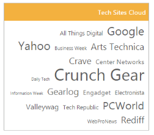

# RTL Support

The EnableRTL feature supports you to change the left-to-right alignment of the TagCloud widget to right-to-left (RTL). This displays the content from right-to-left in the widget. You can achieve this using EnableRTL property that is set false by default.

## Enabling RTL Support

The following steps explains you the EnableRTL property in TagCloud.



<%-- Configure datasource referring local data binding section and assign it to datasource property -- %>

@Html.EJ().TagCloud("tagcloud").Datasource((IEnumerable<WebsiteCollection>)ViewBag.datasource)
.TagCloudFields(tag => tag.Text("Text").Url("Url")
.Frequency("Frequency"))
.Title("Tech sites")
.EnableRTL(true)



The following screenshot illustrates the TagCloud control with RTL support.

