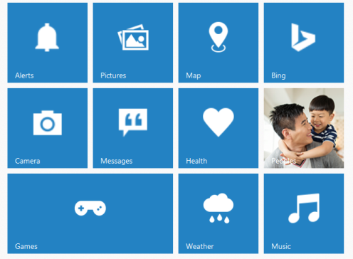

# Add Group Tiles

To make a Tile as grouped tile, you can use the following mentioned pre-defined classes.

<table>
<tr>
<th>
Class Name</th><th>
Explanation</th></tr>
<tr>
<td>
group</td><td>
To group the column elements</td></tr>
<tr>
<td>
column</td><td>
To align the tile in column manner</td></tr>
<tr>
<td>
small-col-2</td><td>
To align the small size tiles</td></tr>
</table>
To render group tile, refer to the following code example.



    

           <!— Add tile control here -->

    



To render column grouped tile, you need to render the number of tiles inside a 
 element with class ‘column’. Then that column group element is appended to a 
 with class ‘group’.     

To render small-col-2 grouped tile, you need to render the number of tiles inside a 
 element with class ‘small-col-2’. Then that small-col-2 group element is appended to a 
 with class ‘column’. Then you need to append those column inside the main group 
 element.                                                     

 Refer the following code examples.



            

@Html.EJ().Tile("tile1").ImageUrl("http://js.syncfusion.com/UG/Web/Content/tile/alerts.png").Text("Alert").TileSize(TileSize.Medium)

@Html.EJ().Tile("tile2").ImageUrl("http://js.syncfusion.com/UG/Web/Content/tile/pictures.png").Text("pictures").TileSize(TileSize.Medium)

@Html.EJ().Tile("tile3").ImageUrl("http://js.syncfusion.com/UG/Web/Content/tile/camera.png").Text("Camera").TileSize(TileSize.Medium)

@Html.EJ().Tile("tile4").ImageUrl("http://js.syncfusion.com/UG/Web/Content/tile/messages.png").Text("Messages").TileSize(TileSize.Medium)

@Html.EJ().Tile("tile5").ImageUrl("http://js.syncfusion.com/UG/Web/Content/tile/games.png").Text("Games").TileSize(TileSize.Wide)

            

            

@Html.EJ().Tile("tile6").ImageUrl("http://js.syncfusion.com/UG/Web/Content/tile/map.png").Text("Map").TileSize(TileSize.Medium)

@Html.EJ().Tile("tile7").ImageUrl("http://js.syncfusion.com/UG/Web/Content/tile/bing.png").Text("Bing").TileSize(TileSize.Medium)

@Html.EJ().Tile("tile8").ImageUrl("http://js.syncfusion.com/UG/Web/Content/tile/favs.png").Text("Health").TileSize(TileSize.Medium)

@Html.EJ().Tile("tile9").ImageUrl("http://js.syncfusion.com/UG/Web/Content/tile/people_2.png").Text("Peoples").TileSize(TileSize.Medium).ImagePosition(TileImagePosition.Fill)

@Html.EJ().Tile("tile10").ImageUrl("http://js.syncfusion.com/UG/Web/Content/tile/weather.png").Text("Weather").TileSize(TileSize.Medium)

@Html.EJ().Tile("tile11").ImageUrl("http://js.syncfusion.com/UG/Web/Content/tile/music.png").Text("Music").TileSize(TileSize.Medium)

            



