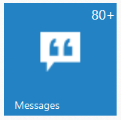

# Configure Badge

The Badge property handles badge specific functionalities like enable or disable the badge and setting badge value for Tile.

Enabled property enables or disables the badge for a Tile. The Tile renders with hidden badge when it is set to false.

The Value property is used to set the badge value to a Tile. By default, the Value is set to 1 on initialization. The Text property is used to set the text instead of number for Tile badge. The MaxValue property is used to set the maximum badge value to a Tile. When you set the badge value greater than MaxValue, it shows maximum value in badge with plus symbol. The MinValue property is used to set the minimum badge value to a Tile. When you set the badge value less than MinValue, it shows minimum value in badge.

Refer to the following code examples.



@Html.EJ().Tile("tile").ImageUrl("http://js.syncfusion.com/UG/Web/Content/tile/messages.png").Badge(badge => { badge.Enabled(true).MaxValue(80).MinValue(10).Value(88); }).ImagePosition(TileImagePosition.Center).TileSize(TileSize.Medium)



