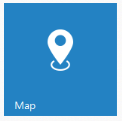
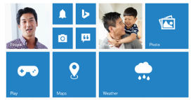

# Getting Started

This section explains briefly on how to create a Tile control in your application.

## Create your first Tile in MVC

The Essential Studio for ASP.NET MVC Web Tiles are simple, opaque rectangles or squares that are arrayed on the Start screen in a grid-like pattern and it can be either static or live. Tapping or selecting a Tile launches the app or other experience that is represented by the Tile.

### Create Tile Widget

The following steps guide you to add group of Tiles for creating a home page that displays all the available applications.

1. You can create an MVC Project and add necessary assemblies, styles and scripts to it.  Refer [MVC-Getting Started.](http://docs.syncfusion.com/aspnetmvc/tile/getting-started)
2. To add a Tile control, call Tile helper. You can specify the tile name, size and image url as follows.
3. Add the following code example to the corresponding view page.

   ~~~ cshtml

	@Html.EJ().Tile("tile1")

	.TileSize(TileSize.Medium)

	.ImageUrl("http://js.syncfusion.com/ug/web/content/tile/map.png")

	.Text("Maps")

   ~~~
   

4. Run the application to render the following output.

In this scenario, a home page is designed using tile for easy navigation. Therefore, you require many different sizes of tiles aligned in a grid-like manner. To align the tiles automatically, define the necessary tile elements inside the wrapper element that contains a ‘column’ class. You can define all columns elements under the wrapper element with ‘group’ class to make ‘n’ number of tiles as a grouped tile.

Refer to the following code example.



        

            

                @Html.EJ().Tile("tile1").ImagePosition(TileImagePosition.Fill).TileSize(TileSize.Medium).ImageUrl("http://js.syncfusion.com/ug/ web/content/tile/people_1.png").Text("People")

                @Html.EJ().Tile("tile2").ImagePosition(TileImagePosition.Center).TileSize(TileSize.Small).ImageUrl("http://js.syncfusion.com/ug/web/content/tile/alerts.png")

                @Html.EJ().Tile("tile3").ImagePosition(TileImagePosition.Center).TileSize(TileSize.Small).ImageUrl("http://js.syncfusion.com/ug/web/content/tile/bing.png")

                @Html.EJ().Tile("tile4").ImagePosition(TileImagePosition.Center).TileSize(TileSize.Small).ImageUrl("http://js.syncfusion.com/ug/web/content/tile/camera.png")

                @Html.EJ().Tile("tile5").ImagePosition(TileImagePosition.Center).TileSize(TileSize.Small).ImageUrl("http://js.syncfusion.com/ug/ web/content/tile/messages.png")

                @Html.EJ().Tile("tile6").ImagePosition(TileImagePosition.Center).TileSize(TileSize.Medium).ImageUrl("http://js.syncfusion.com/ug/web/content/tile/games.png").Text("Play")

                @Html.EJ().Tile("tile7").TileSize(TileSize.Medium).ImageUrl("http://js.syncfusion.com/ug/web/content/tile/map.png").Text("Maps")

            

            

                @Html.EJ().Tile("tile9").ImagePosition(TileImagePosition.Fill).TileSize(TileSize.Medium).ImageUrl("http://js.syncfusion.com/ug/web/content/tile/people_2.png").Text("People")

                @Html.EJ().Tile("tile10").ImagePosition(TileImagePosition.Center).TileSize(TileSize.Medium).ImageUrl("http://js.syncfusion.com/ug/web/content/tile/pictures.png").Text("Photo")

                @Html.EJ().Tile("tile11").ImagePosition(TileImagePosition.Center).TileSize(TileSize.Wide).ImageUrl("http://js.syncfusion.com/ug/web/content/tile/weather.png").Text("Weather")

            

        

    
    



Run the application to render the following output.

