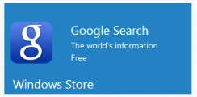

## Template Support

ImageTemplateId property is used to customize the image of Tile with template feature by setting the id. CaptionTemplateId property is used to customize the text of Tile with template feature by setting the id. 

Refer to the following code examples.

Add the following code example for MVC samples 

    &lt;style&gt;

        #appimage {

            background-image: url("http://js.syncfusion.com/UG/mobile/content/google.png");

            background-position: center center;

            background-repeat: no-repeat;

            background-size: 50% auto;

            display: table-cell;

            width: 45%;

        }

        .tileMargin {

            display: table-cell;

            padding-top: 25px;

        }

        .e-tile-template {

            display: table;

            height: 100%;

            width: 100%;

        }

    &lt;/style&gt;

@Html.EJ().Tile("tile").ImageTemplateId("imageTemplate").CaptionTemplateId("captionTemplate").TileSize(TileSize.Wide)

&lt;div id="imageTemplate"&gt;

        &lt;div id="appimage"&gt;

        &lt;/div&gt;

        &lt;div class="tileMargin"&gt;

            Google Search&lt;br /&gt;

            The world’s information&lt;br /&gt;

            Free

        &lt;/div&gt;

    &lt;/div&gt;

    
Windows Store

{  | markdownify }
{:.image }

