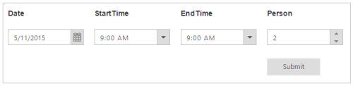
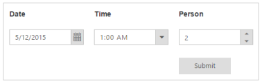
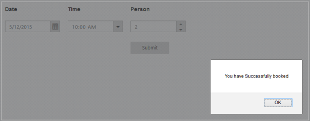
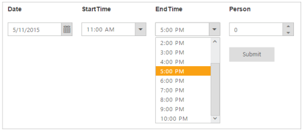
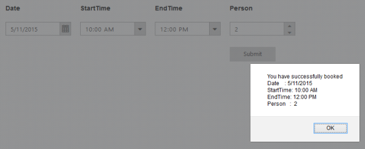

# Getting Started

This section explains briefly about how to create a TimePicker in your application with ASP.NET MVC.

## Create your first TimePicker in MVC

Essential MVCTimePicker provides support to display the time in your webpage and allows you to pick a time from the list. In this section you can learn how to customize TimePickers in a real-time application. The following example shows you how to use the TimePicker control to book a hotel dining table booking application, within a limited time, in any day.

{{ '' | markdownify }}
{:.image }

The above screenshot illustrates the functionality of a TimePicker, with a time range from morning to evening. You can select the time to book a table ranging from 9.00 AM to 10.00 PM in the current day. This avoids selecting a time prior to that day.

Create a TimePicker

Essential MVC TimePicker widget has built-in features such as keyboard navigation, other time navigation with animations, and flexible APIs. You can easily create the TimePicker widget using simple TimePicker element as follows.

1. You can create an MVC Project and add necessary assemblies and scripts to it. Refer [MVC-Getting Started](http://help.syncfusion.com/ug/js/Documents/gettingstartedwithmv.htm) Documentation.
2. Add the following code to the corresponding view page to render the TimePicker.

[CSHTML]

@*Add the following code example to the corresponding CSHTML page to render TimePicker widget*@

<table>

    <tr>

        <td class="tdclass">Date</td>

        <td class="tdclass">Time</td>

        <td class="tdclass">Person</td>

    </tr>

    <tr>

        <td class="tdclass">

            

                @Html.EJ().DatePicker("startDate")

            

        </td>

        <td class="tdclass">

            

                @Html.EJ().TimePicker("timestart")

            

        </td>

        <td class="tdclass">

            

                @Html.EJ().NumericTextbox("NumericTextbox").Value("0")

            

        </td>

    </tr>

    <tr>

        <td></td>

        <td></td>

        <td class="tdclass">

            

                @Html.EJ().Button("Submit").Width("100px").Size(ButtonSize.Small).Text("Submit").ClientSideEvents(s => s.Click("button"))

            

        </td>

    </tr>

</table>

3.   Add the following styles to show the TimePicker control in horizontal order in the Content folder.

4.  Add the following code to the Layout page for DatePicker and TimePicker initialization.

__

5. The following screenshot displays the output for the above code.

{{ '' | markdownify }}
{:.image }

6. Click the submit button in the application to render the following output.

{{ '' | markdownify }}
{:.image }

Set Min and Max Date

In a real-time scenario, the booking is open only for a limited time. You can select a date and time from the given range using the properties MinDate, MinTime and MaxDate, MaxTime that enables only the dates and times ranging between the MinDate, MinTime and MaxDate, MaxTime in the DatePicker and TimePicker.

1. Add the following code to the corresponding view page to render the TimePicker.

[CSHTML]

@*Add the following code example to the corresponding CSHTML page to render TimePicker widget*@

<table>

    <tr>

        <td class="tdclass">Date</td>

        <td class="tdclass">StartTime</td>

        <td class="tdclass">EndTime</td>

        <td class="tdclass">Person</td>

    </tr>

    <tr>

        <td class="tdclass">

            

                @Html.EJ().DatePicker("startDate").Value("5/11/2015").MinDate("5/11/2015").MaxDate("6/11/2015")

            

        </td>

        <td class="tdclass">

            

                @Html.EJ().TimePicker("timestart").MinTime("9:00 AM").MaxTime("10:00 PM").Interval(60).ClientSideEvents(e => e.Select("selectedStartTime"))

            

        </td>

        <td class="tdclass">

            

                @Html.EJ().TimePicker("timeend").MinTime("9:00 AM").MaxTime("10:00 PM").Interval(60)

            

        </td>

        <td class="tdclass">

            

                @Html.EJ().NumericTextbox("NumericTextbox").Value("0")

            

        </td>

    </tr>

    <tr>

        <td></td>

        <td></td>

        <td></td>

        <td class="tdclass">

            

                @Html.EJ().Button("Submit").Width("100px").Size(ButtonSize.Small).Text("Submit").ClientSideEvents(s => s.Click("button"))

            

        </td>

    </tr>

</table>

2.  Add the following styles to show the TimePicker control in horizontal order in the Content folder.

3.  Add the following code to the Layout page for DatePicker and TimePicker initialization.

__

4. The following screenshot displays the output for the above code. 

{{ '' | markdownify }}
{:.image }

You can select the Start time in the first TimePicker and select the End time within the given range. The second TimePicker start value is based on the first TimePicker’s selected value. This is illustrated in the following screenshots.

{{ '' | markdownify }}
{:.image }

{{ '' | markdownify }}
{:.image }

Display Reserved Time 

An acknowledgement message appears when you click the Submit button. 

You can specify the alert message in the script as follows.

{{ '' | markdownify }}
{:.image }

