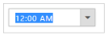

# Keyboard Interaction

You can use Keyboard shortcut keys as an alternative to the mouse on using TimePicker widget. TimePicker widget allows you to perform all kinds of actions using keyboard shortcuts. For enabling the keyboard navigation, we need to set the access key to TimePicker control by using HtmlAttributes property. The HtmlAttributes receives the IDictinary object. The IDictionary represents a generic collection of key/value pairs.

The various keyboard shortcuts available within the TimePicker widget are discussed in the following table.

_Table 1: List of keyboard shortcuts_

<table>
<tr>
<th>
Shortcut Key</th><th>
Description</th></tr>
<tr>
<td>
{{ '[Access key](http://en.wikipedia.org/wiki/Access_key)' | markdownify }} + j</td><td>
Focuses into Timepicker widget</td></tr>
<tr>
<td>
Alt + Down</td><td>
Opens/Hides the popup</td></tr>
<tr>
<td>
Right/Left</td><td>
Moves to adjacent part</td></tr>
<tr>
<td>
Up</td><td>
Increments the value</td></tr>
<tr>
<td>
Down</td><td>
Decrements the value</td></tr>
</table>

## When popup is open

_Table 2: List of keyboard shortcuts_

<table>
<tr>
<th>
Shortcut Key</th><th>
Description</th></tr>
<tr>
<td>
Up</td><td>
Selects the previous time </td></tr>
<tr>
<td>
Down </td><td>
Selects the next time.</td></tr>
<tr>
<td>
Home/End</td><td>
Moves to the first / last item</td></tr>
<tr>
<td>
Esc</td><td>
Closes the popup</td></tr>
</table>

## Configure Keyboard Interaction

The following steps explains you on how to enable keyboard interaction for the TimePicker widget with accesskey as “j”. We can set the any other key as accesskey in TimePicker control.

1. Add the following code to the corresponding view page to render the TimePicker.



@*Add the following code example to the corresponding CSHTML page to render TimePicker widget*@

@{IDictionary<string, object> parameters = new Dictionary<string, object>();

    parameters.Add("accesskey", "j");

}

@Html.EJ().TimePicker("time").HtmlAttributes(parameters)


2. Run the code sample, press [Access key](http://en.wikipedia.org/wiki/Access_key) + J to focus in the TimePicker widget that enables it and you can navigate using arrow keys and Esc key to close the popup.

_Figure 19: TimePicker focused with keyboard shortcut_

