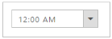

# TimePicker Customization

The TimePicker provides support to display a TimePicker in your webpage and allows you to pick a time from it.

## Creating TimePicker Widget

The following steps explains you to create a TimePicker widget.

1. Add the following code to the corresponding view page to render the TimePicker.

   ~~~ js

		@*Add the following code example to the corresponding CSHTML page to render TimePicker widget*@

		@Html.EJ().TimePicker("time")

   ~~~
   {:.prettyprint }

2. The following screenshot illustrates you a default TimePicker.

_Figure 8: TimePicker Control_

