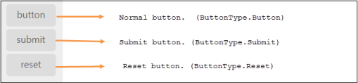

# Button types

Toggle Button is used as normal clickable button, submitting form data, resetting the form data to its initial value. According to the usage of button, you can render the Toggle Button in the following three types by using the Type property.

_Table_ _5__: Toggle Button Types_

<table>
<tr>
<td>
Button</td><td>
The button is a clickable button </td></tr>
<tr>
<td>
Submit</td><td>
The button is a submit button (submits form-data)</td></tr>
<tr>
<td>
Reset    </td><td>
The button is a reset button (resets the form-data to its initial values)</td></tr>
</table>

The following steps explains you the details about rendering the Toggle Button with above mentioned types. 

1. In the View page, add the following button elements to configure Toggle Button widget.



@*Add the code in CSHTML page to configure the widget and initialize the control*@

    

        @*set toggle button type using type property*@

        <table>

            <tr>

                <td class="btnsht">

                    @Html.EJ().ToggleButton("toggleButton_button").Size(ButtonSize.Mini).ShowRoundedCorner(true).ContentType(ContentType.TextOnly).DefaultText("button").ActiveText("Next").Type(ButtonType.Button)

                </td>

                </tr>

            <tr>

                <td class="btnsht">

                    @Html.EJ().ToggleButton("toggleButton_submit").Size(ButtonSize.Mini).ShowRoundedCorner(true).ContentType(ContentType.TextOnly).DefaultText("submit").ActiveText("Next").Type(ButtonType.Submit)

                </td>

                </tr>

            <tr>

                <td class="btnsht">

                    @Html.EJ().ToggleButton("toggleButton_reset").Size(ButtonSize.Mini).ShowRoundedCorner(true).ContentType(ContentType.TextOnly).DefaultText("reset").ActiveText("Next").Type(ButtonType.Reset)

                </td>

            </tr>

        </table>

    



Execute the above code to render the following output.

_Figure_ _17__: Types of Toggle button_

